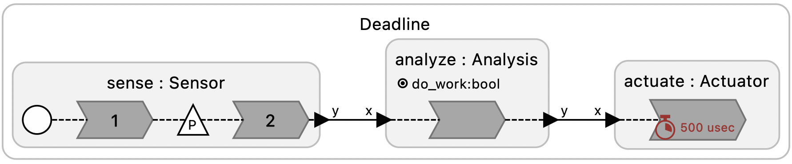

# Deadlines

These examples illustrate the use of deadlines in Lingua Franca. The first example illustrates the most common use of deadlines, which require a reaction to start executing before physical time exceeds the logical time of the triggering event plus the specified deadline. The second example illustrates a long-running reaction that violates the deadline *after* execution has started, detects that violation, and stops executing.

<table>
<tr>
<td>  </td>
<td> <a href="Deadline.lf">Deadline.lf</a>: An asynchronous input (keyboard Return button) alternates between triggering a long computation and skipping it. When the long reaction occurs, the deadline in the Actuator is missed. Otherwise, the deadline is met.</td>
</tr>
<td>  </td>
<td> <a href="AnytimePrime.lf">AnytimePrime.lf</a>: This example calculates the largest prime number that it can find within three sections of (physical) execution time. This is an example of an <a href="https://en.wikipedia.org/wiki/Anytime_algorithm">anytime algorithm</a>. Here, the deadline specified in the Prime reactor is always met, in that the reaction starts within the deadline. But within the reaction execution, the <code>lf_check_deadline()</code> function gets checked periodically so that the computation is stopped as soon as possible after the deadline expires.</td>
</tr>
</table>