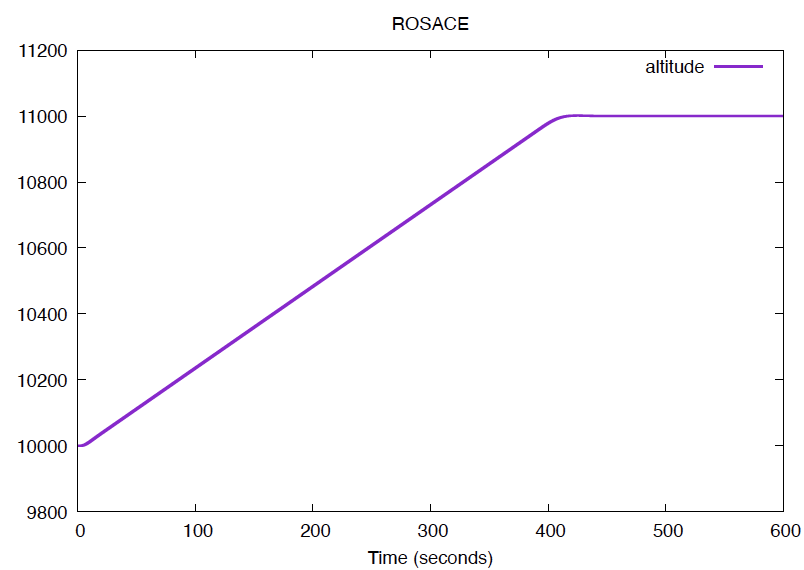
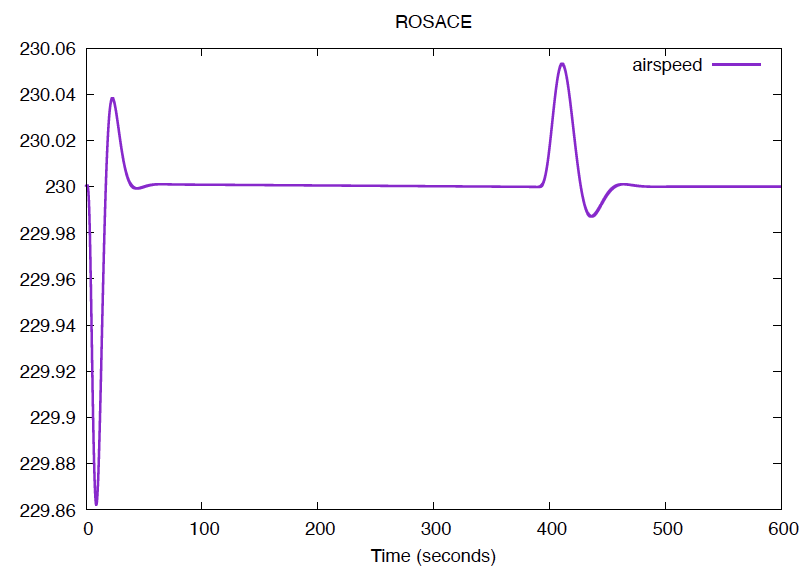
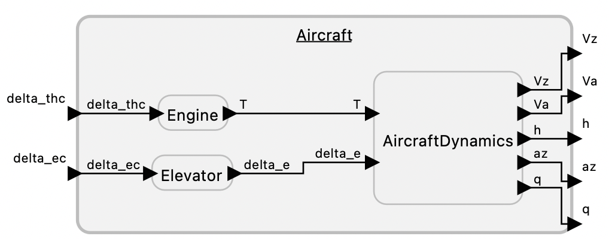

# Aircraft Controller -- The ROSACE Case Study

This example implements an aircraft autopilot controller and aircraft simulator as described in:

> Claire Pagetti, David Saussiéy, Romain Gratia, Eric Noulard, and Pierre Siron, "[The ROSACE Case Study: From Simulink Specification to Multi/Many-Core Execution](https://doi.org/10.1109/RTAS.2014.6926012)," RTAS (2014).

Executing this program with the default parameters should show the aircraft altitude rising smoothly from 10,000 to 11,000 feet with minor variations in aircraft speed, as shown in the following plots:

Although Lingua Franca programs are, in general, event driven, this example is a periodic real-time program with a multiplicity of periods. Each of the reactors is triggered by a timer that specifies its period. If its reactions read data from input ports, those ports are declared in the [*uses* field](https://www.lf-lang.org/docs/handbook/inputs-and-outputs?target=c#triggers-effects-and-uses) of the reactor signature rather than the *triggers* field. The dependencies are automatically handled by the LF code generator so that upstream reactions that execute in the same tag will always complete before a downstream reaction that uses its data.

Note that these examples rely on the persistence of port data that is implemented in the C target. That is, when reading data from an input port declared in the *uses* field, the *most recently received* data will be provided even if, at the current tag, that port is absent. These examples would have to be designed in a different way in a target that does not support persistent data, such as the Cpp target.

Note that these files have a difference [LICENSE](LICENSE.md) than the standard in Lingua Franca.

<table>
<tr>
<td> 
<td> <a href="Rosace.lf">Rosace.lf</a>: A composition of the aircraft and controller, illustrating periodic sample rates interacting.</td>
</tr>
<tr>
<td> 
<td> <a href="AircraftSimulator.lf">AircraftSimulator.lf</a>: A forward Euler simulation of aircraft dynamics (from teh ROSACE case study).</td>
</tr>
<tr>
<td> 
<td> <a href="RosaceController.lf">RosaceController.lf</a>: A controller for an aircraft (from the ROSACE case study).</td>
</tr>
</table>