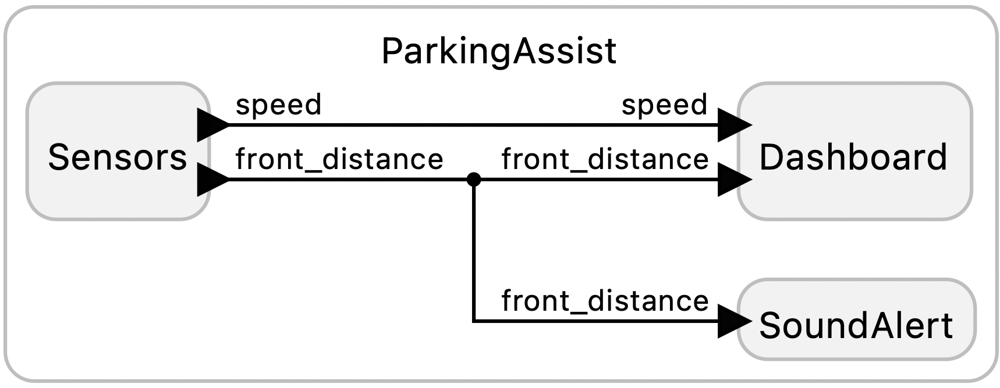

# Software Defined Vehicle -- A Sketch

This example implements a sketch of how a software-defined vehicle (SDV) could be designed. It uses a browser for the dashboard display, keyboard input for user commands, and sound generation for auditory feedback. For example, the browser displays the following when a front obstacle is close to the vehicle, accompanied by an audible alert:

<table>
<tr>
<td> 
<td> <a href="ParkingAssist.lf"> ParkingAssist.lf </a>: A simple parking assistant that emulates distance sensors feeding a dashboard display with audio feedback.</td>
</tr>
</table>