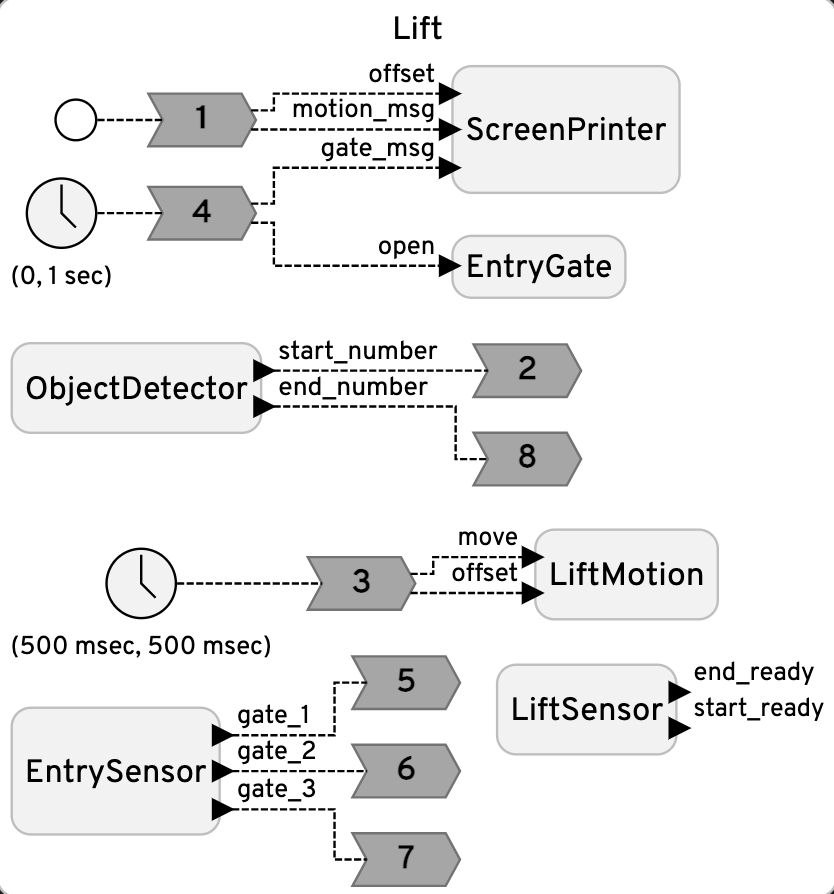
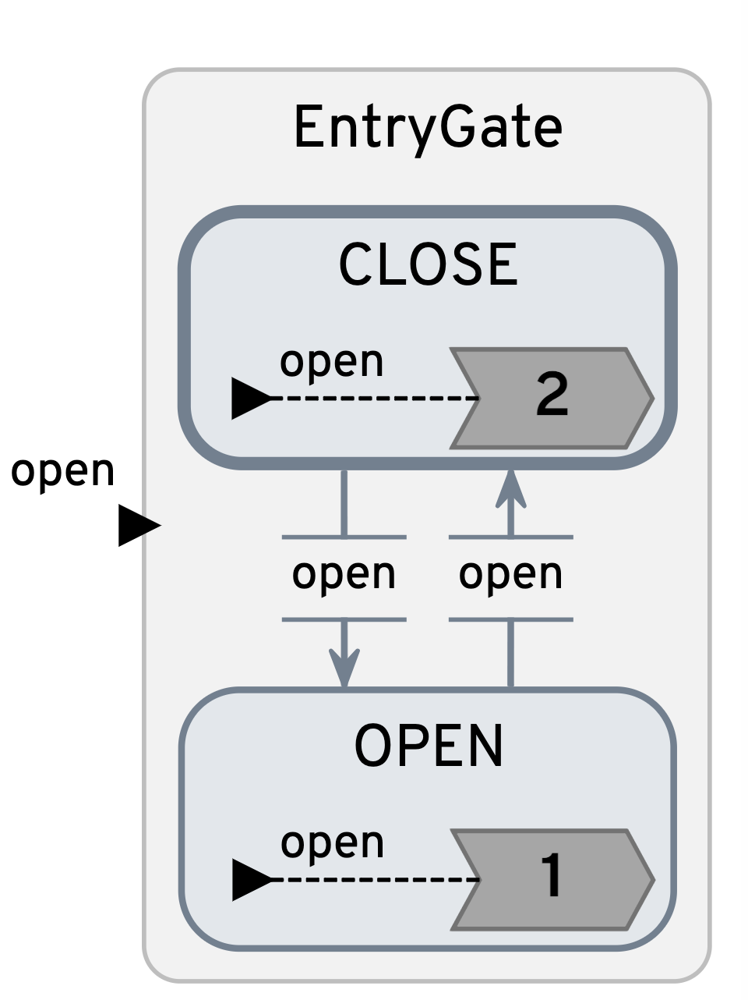
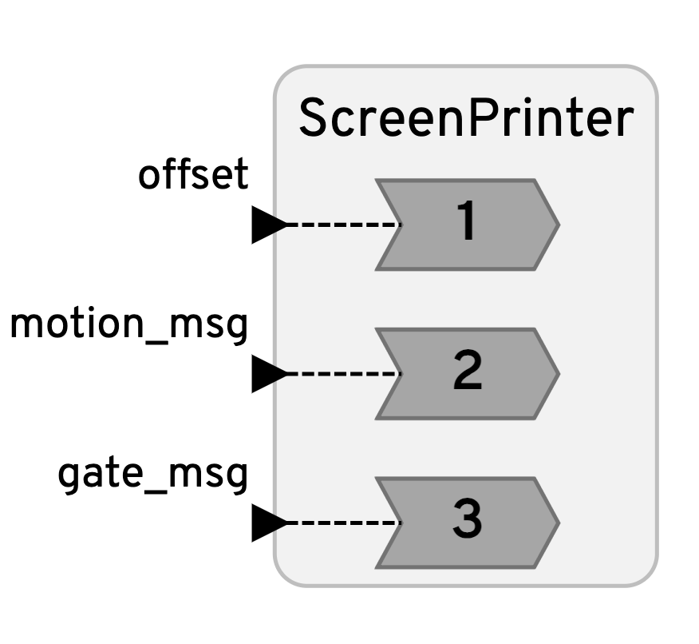
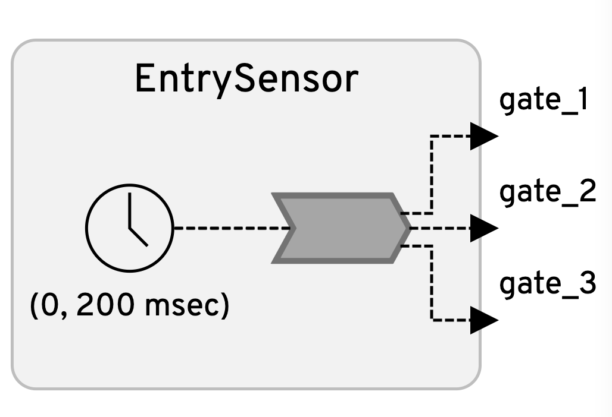
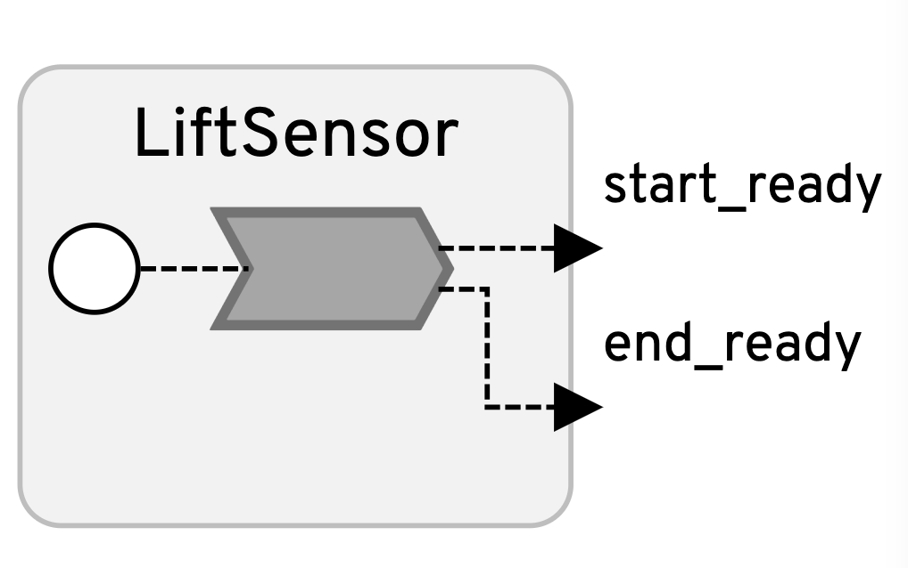
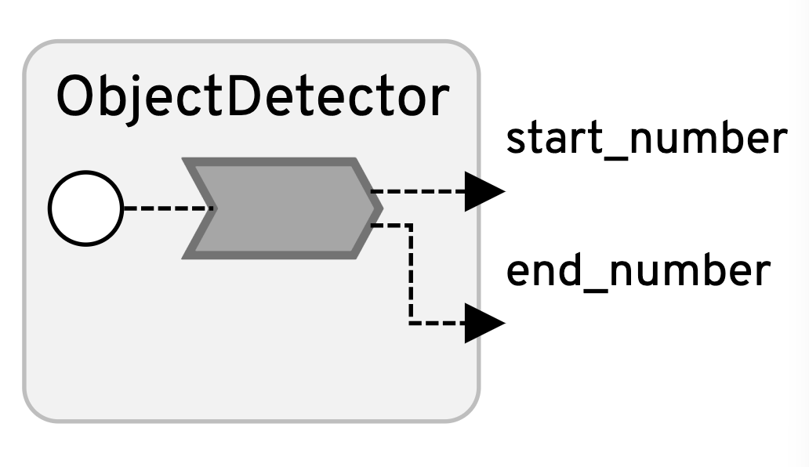
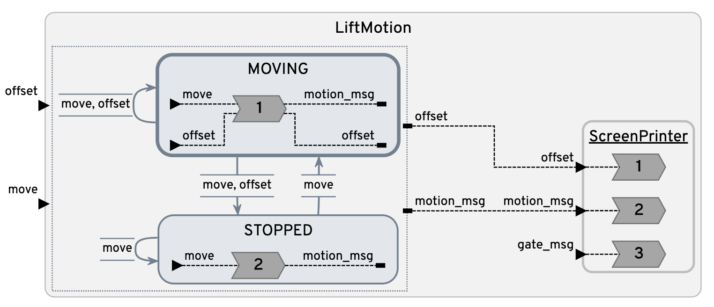

<h1 align="center">
  <br>
  
  <br>
  <br>
  Autonomous Ski Lift System
  <br>
</h1>

<h4 align="center">A safe and efficient ski lift system build with <a href="https://www.lf-lang.org/" target="_blank">Lingua Franca</a>.</h4>

<br>

<div display="block" align="center">
<video width="600" controls>
  <source src="assets/demo.mov" type="video/mp4">
  Your browser does not support the video tag.
</video>
</div>


## About the Project

This project simulates the behavior of ski lifts with a focus on improving safety and reducing labor costs through automation using Lingua Franca. The simulation models key aspects of ski lift operations, including:

1. **Passenger Flow & Lift Capacity**
    - Ensuring smooth and efficient boarding/unboarding.
2. **Safety Mechanisms**
    - Detecting potential dangers and automating responses to prevent accidents.
3. **Autonomous Control**
    - Optimizing lift operations with minimal human intervention.

The goal is to explore how automation can enhance safety while reducing operational costs, making ski lifts more efficient and reliable.

## How To Use

To clone and run this application, you'll need [Git](https://git-scm.com) and [Lingua Franca](https://www.lf-lang.org/docs/installation) installed on your computer. From your command line:

```bash
# Clone this repository
$ git clone https://github.com/lf-lang/playground-lingua-franca.git

# Go into the example folder of the repository
$ cd playground-lingua-franca/examples/C

# Compile the main reactor
$ lfc src/SkiLift/Lift.lf

# Run the program
$ bin/Lift
```

> **Note:**
> Or you can compile and run the program simply using VS Code, [see section "Running Locally"](https://github.com/lf-lang/playground-lingua-franca).


## Components (Reactors)

<table>
<tr>
<td> 
<td> <a href="Lift.lf">Lift.lf</a>: The main reactor that controls all timed and startup events, receives signals from sensors, and manages the lift behavior.</td>
</tr>
<tr>
<td> 
<td> <a href="lib/EntryGate.lf">EntryGate.lf</a>: Uses a modal model to control the opening and stopping of the entry gate.</td>
</tr>
<tr>
<td> 
<td> <a href="lib/ScreenPrinter.lf">ScreenPrinter.lf</a>: Manages stdout behavior for the ski lift simulation. This reactor handles printing lift animations, clearing lines, and refreshing the displayed output to ensure smooth and dynamic visualization.</td>
</tr>
<tr>
<td> 
<td> <a href="lib/EntrySensor.lf">EntrySensor.lf</a>: Processes data from the sensor placed at the entry gate. This reactor tracks the number of people attempting to board the lift, ensuring accurate passenger flow management.</td>
</tr>
<tr>
<td> 
<td>
    <a href="lib/LiftSensor.lf">LiftSensor.lf</a>:  Processes data from two sensors—one at the start of the lift and one at the end.
    <ul>
        <li><strong>Start sensor:</strong> Detects when a lift chair is ready to carry passengers in the ready area. If triggered, it signals the gate to open, allowing the next group of passengers to board.</li>
        <li><strong>End sensor:</strong> Detects when a lift chair reaches the unloading area. If triggered, it checks whether any passengers remain in the exit area, ensuring a smooth and safe unloading process.</li>
    </ul>
</td>
</tr>
<tr>
<td> 
<td> <a href="lib/ObjectDetector.lf">ObjectDetector.lf</a>: Detects the number of people on the ready and exit areas.</td>
</tr>
<tr>
<td> 
<td> <a href="lib/LiftMotion.lf">LiftMotion.lf</a>: Uses a modal model to control the motion of the lift.</td>
</tr>
</table>


