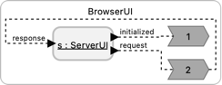
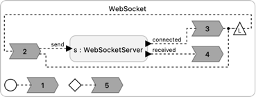
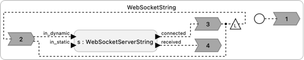

# Browser UI

These examples show how to create user interfaces for a Lingua Franca program.
The UI runs in the browser and connects to the program via either HTTP or via a web socket.

<table>
<tr>
<td> 
<td> <a href="BrowserUI.lf">BrowserUI.lf</a>: This version starts a web server that serves a specified web page and enables implementing an HTTP-based API to control your LF program.  When the program is running, you can point your browser to <a href="http://localhost:8080">http://localhost:8080</a> to get a page.  Adding a path to the URL, as in for example, <a href="http://localhost:8080/count">http://localhost:8080/count</a>, will cause the ServerUI reactor to produce an output that your LF program can react to and send a (text) response.</td>
</tr>
<tr>
<td> 
<td> <a href="WebSocket.lf">WebSocket.lf</a>: This example uses the much more versatile WebSocketServer reactor. When the program is running, you can open an HTML page that includes JavaScript that connects to the server.  Messages can be sent in both directions over the web socket, from the LF program to the browser and vice versa. <b>Requires installing install libwebsockets</b>.</td>
</tr>
<tr>
<td> 
<td> <a href="WebSocketString.lf">WebSocketString.lf</a>: This version uses the simpler WebSocketServerString reactor, which is simpler in that it restricts the messages transported over the web socket to be of string types and it allows only one client to connect. <b>Requires installing install libwebsockets</b>.</td>
</tr>
<tr>
<td> 
<td> <a href="Uptime.lf"> Uptime.lf</a>: This version uses WebSocketServer to serve a web page and then feed it data continuously through a web socket. The application displays the total time that application has been running and updates this time once per second. <b>Requires installing install libwebsockets</b>.</td>
</tr>
</table>
