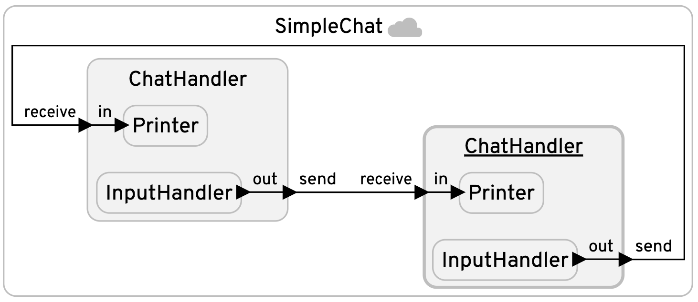

# Simple Chat Application

This program is a simple federated chat application written in Lingua Franca (LF) for two users,
represented by two instances of the `ChatHandler` reactor, `a` and `b`. Each `ChatHandler`
consists of an `InputHandler` and a `Printer`. The `InputHandler` is responsible for receiving
user input from the console and sending it as a message. When the user enters a message, the
`InputHandler` reads it, prints it, and then sends it via its `out` port. The message then gets
relayed by the `ChatHandler` via its `send` port. On the receiving side, the `ChatHandler`
directs the incoming message through its `receive` port to the `Printer` reactor, which prints
the received message. This process creates a two-way communication where `a` and `b` can send and
receive messages from each other.

Among other things, this example illustrates the use of the `string` datatype in federated execution.

@note: This example needs to be run manually with each federate run from its own terminal window.
After compiling with `lfc`, create three terminal windows and run the following commands in each
window:
1. `fed-gen/SimpleChat/bin/RTI -n 2`
2. `fed-gen/SimpleChat/bin/federate_a`
3. `fed-gen/SimpleChat/bin/federate_b`

<table>
<tr>
<td> 
<td> <a href="SimpleChat.lf">SimpleChat.lf</a>: Simple two-user chat application.</td>
</tr>
</table>
