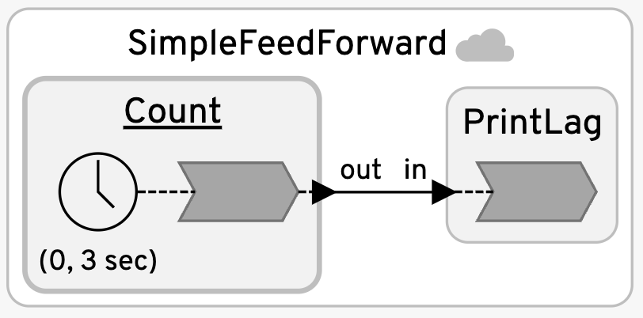
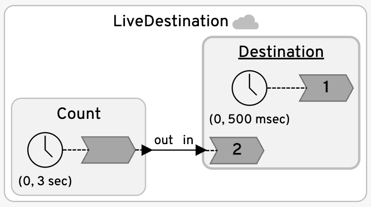
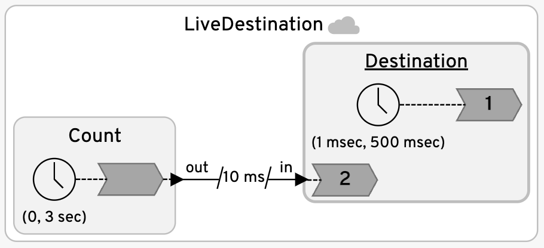
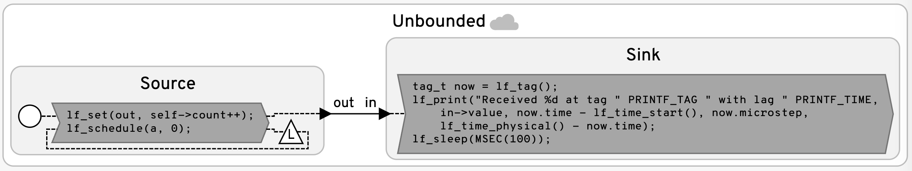
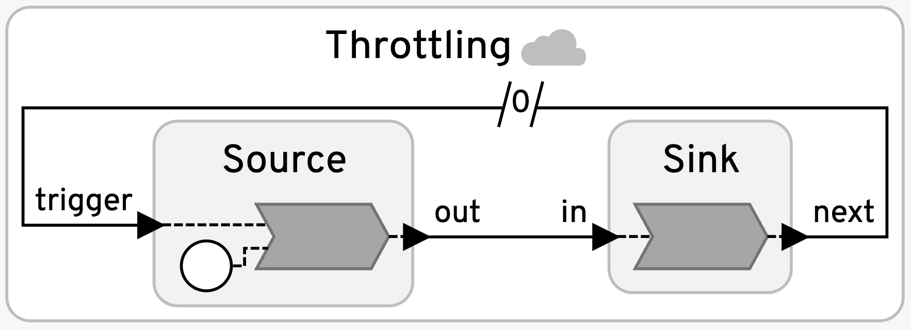
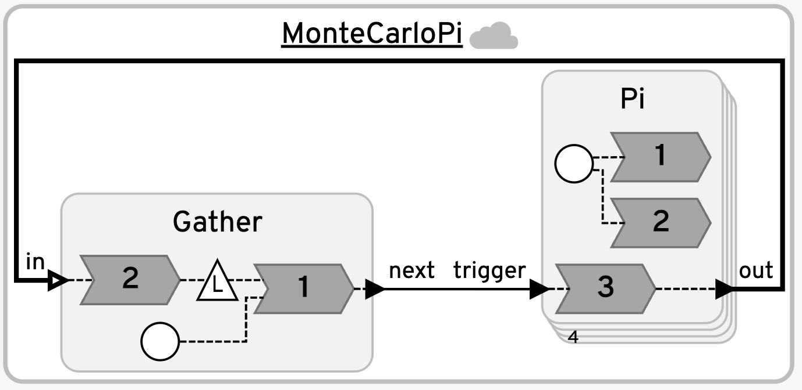

# Decentralized Coordination
The decentralized coordinator for federated Lingua Franca programs is an experimental technology with many subtleties. This coordinator is specified as a target property:

```
target {
  coordination: decentralized
}
...
federated reactor {
  a = new A()
  b = new B()
  ...
}
```

Each top-level reactor instance, such as `a` and `b` above, runs as a separate program called a "federate," possibly on different machines or in separate containers.

## The Role of the RTI
Like the (default) centralized coordinator, the runtime infrastrcture (RTI) orchestrates the startup (and shutdown) of the federation, but unlike the centralized coordinator, the RTI plays little role during the execution of the program. Its function is limited to:

* handling requests to shut down the federation, via `lf_request_stop()` in C or `request_stop()` in Python; and
* performing runtime clock synchronization, if this is enabled.

## STA and STAA
Each federate makes its own decisions about when to advance to a tag _g_ = (_t_, _m_) and invoke reactions at that tag.  To govern these decisions, there are two key variables that a programmer must specify:

* **STA**: The "safe to advance" offset is a physical time quantity that asserts that the federate can advance to a tag _g_ = (_t_, _m_) when its local physical clock time. _T_ satisfies _T_ >= _t_ + _STA_.
* **STAA**: The "safe to assume absent" offset is a physical time quantity that asserts that the federate can assume that an input to the federate is absent at tag _g_ = (_t_, _m_) when its local physical clock time _T_ satisfies _T_ >= _t_ + _STA_ + _STAA_.

The STA is a property of a federate and is defined as a parameter for the reactor class:

```
reactor A(STA:time = <default>) { ... }
```

The STAA is associated with one or more input ports, but it is declared on reactions to those input ports:

```
reactor A {
  input in:<type>
  reaction(in) {=
    <normal operation>
  =} STAA(<time value>) {=
    <fault handler>
  =}
}
```

Any network input port will have that STAA applied to it if it is a trigger for or is used by a reaction that declares an STAA handler.
If more than one STAA is declared for the same input port, the minimum time value will be the one in effect.  The `<fault handler>` is code that will be executed if an input had been previously assumed to be absent at a tag _g_, but then an input event with tag _g_ arrives.

Choosing suitable STAs and STAAs for a program is challenging and depends on many factors.  Collectively, STA and STAA are both referred to as **STP** (safe to process) offsets, but the distinction between the two is important and subtle.

## Example 1: Simple Feedforward System

Consider the [SimpleFeedForward](SimpleFeedforward.lf) example:



This program mostly works with the default STA and STAA being zero. Suppose `PrintLag` is defined as follows:

```
reactor PrintLag {
  input in: int
  reaction(in) {=
    interval_t lag = lf_time_physical() - lf_time_logical();
    lf_print("**** Reaction to network input %d lag is " PRINTF_TIME "us at logical time " PRINTF_TIME "us, microstep %d.",
        in->value, lag/1000, lf_time_logical_elapsed()/1000, lf_tag().microstep);
  =}
}
```

When we execute this program, the output may look like this:

```
Fed 0 (c): Starting timestamp is: 1723205782147571000.
Fed 1 (p): Starting timestamp is: 1723205782147571000.
Fed 1 (p): Environment 0: ---- Spawning 1 workers.
Fed 0 (c): Environment 0: ---- Spawning 1 workers.
Fed 1 (p): ERROR: STP violation occurred in a trigger to reaction 1, and there is no handler.
**** Invoking reaction at the wrong tag!
Fed 1 (p): **** Reaction to network input 1 lag is 4645us at logical time 0us, microstep 1.
Fed 1 (p): **** Reaction to network input 2 lag is 3664us at logical time 3000000us, microstep 0.
Fed 1 (p): **** Reaction to network input 3 lag is 2567us at logical time 6000000us, microstep 0.
Fed 1 (p): **** Reaction to network input 4 lag is 3194us at logical time 9000000us, microstep 0.
...
```

Notice that the very first reaction is invoked, incorrectly, at microstep 1. This may or may not happen, but if it does, it is because, with STA and STAA both being zero, the runtime system commits to the start tag (0, 0) (elapsed), sees no network input, concludes the input is absent at (0, 0), and completes execution at that tag without invoking any reactions.
When an input subsequently arrives with intended tag (0, 0), that tag cannot be assigned to it because the runtime system has already completed execution at that tag. Hence, the input gets assigned the next available tag, (0, 1), and the reaction is invoked with the stated warning.

Notice that subsequent reactions do not experience an STP violation. In fact, if we were to change the offset on the timer in the program to be bigger than 0, then the entire program would run correctly without any STP violations.  The reason for this is the `PrintLag` reactor has no events of its own except the ubiquitous `startup` event, which all reactors have.  Thus, after concluding tag (0, 0), it does not know what tag to advance to until it receives an input message. By then, there will be no need to assume the input is absent (it isn't), so it can immediately commit to the tag and execute the reactions.

The `Count` reactor also experiences no STP violations. It has no network inputs, and therefore is free to advance its tag without risk. Hence, an STA and STAA of zero work fine for that reactor.

### Adding an STAA

We can modify the `PrintLag` reactor as follows:

```
reactor PrintLag {
  input in: int
  reaction(in) {=
    interval_t lag = lf_time_physical() - lf_time_logical();
    lf_print("**** Reaction to network input %d lag is " PRINTF_TIME "us at logical time " PRINTF_TIME "us, microstep %d.",
        in->value, lag/1000, lf_time_logical_elapsed()/1000, lf_tag().microstep);
  =} STAA(10ms) {=
    lf_print("**** STP violation at PrintLag at tag " PRINTF_TAG, lf_tag().time - lf_time_start(), lf_tag().microstep);
  =}
}
```

The addition of the STAA has two effects. First, it tells the runtime system to wait before assuming the input is absent.  Second, provides a handler to invoke when the wait is insufficient and a message later arrives with a tag that is now in the past.  The output now looks like this:

```
Fed 1 (p): **** Reaction to network input 1 lag is 4530us at logical time 0us, microstep 0.
Fed 1 (p): **** Reaction to network input 2 lag is 2941us at logical time 3000000us, microstep 0.
Fed 1 (p): **** Reaction to network input 3 lag is 2884us at logical time 6000000us, microstep 0.
Fed 1 (p): **** Reaction to network input 4 lag is 2897us at logical time 9000000us, microstep 0.
...
```

Notice that there are no STP violations and the lag is no worse than before.
The STAA of 10ms seems reasonable given that the observed latencies are reliably around 5ms. The lag is no worse than before because `Count` is reliably sending messages, and hence `PrintLag` never has to actually assume the input is absent.

In fact, for this program, we could set the STAA to a very large time. For example:

```
  reaction(in) {=
    ...
  =} STAA(100 weeks) {=
    ...
  =}
```

The lag will still not be worse than before, as long as `Count` remains reliable.

### Using STA vs. STAA

For this example, it would work equally well to set the STA rather than the STAA.
If we change the `PrintLag` reactor to read like this:

```
reactor PrintLag(STA: time = 100 weeks) {
  input in: int
  reaction(in) {=
    interval_t lag = lf_time_physical() - lf_time_logical();
    lf_print("**** Reaction to network input %d lag is " PRINTF_TIME "us at logical time " PRINTF_TIME "us, microstep %d.",
        in->value, lag/1000, lf_time_logical_elapsed()/1000, lf_tag().microstep);
  =}
}
```

In this case, once again, there will be no STP violations and the lag will be no worse than before.
This is because the runtime system does not wait for the STA time to elapse once the network inputs become known to be present or absent.

There is an interesting subtlety with this solution.
The STA is in fact ignored when deciding whether to advance to the start tag (0, 0).
This is because all inputs with tags earlier than (0, 0) are known to be absent, so it is always safe to advance to (0, 0).
So why do we not get an STP violation here?
The reason is that before reacting to the input `in`, the runtime system waits until either the input becomes known at (0, 0) or its physical clock _T_ hits 0 + STA + STAA.
The STA is always added to the STAA, so with this setting, if an input never arrives, the `PrintLag` lag reactor will in fact be stuck at (0, 0) for 100 weeks.

### Using a Timeout

Suppose that we change the `target` declaration in the above program to add a timeout:

```
target C {
  coordination: decentralized,
  timeout: 6s
}
```

With the STA set to 100 weeks, this program will nonetheless terminate correctly after receiving the input at tag (6s, 0):

```
Fed 0 (c): Starting timestamp is: 1722803307426429000.
Fed 1 (p): Starting timestamp is: 1722803307426429000.
Fed 1 (p): Environment 0: ---- Spawning 1 workers.
Fed 0 (c): Environment 0: ---- Spawning 1 workers.
Fed 1 (p): **** Reaction to network input 1 lag is 1439us at logical time 0us, microstep 0.
Fed 1 (p): **** Reaction to network input 2 lag is 3589us at logical time 3000000us, microstep 0.
Fed 1 (p): Socket from federate 0 is closed.
Fed 0 (c): Connection to the RTI closed with an EOF.
Fed 1 (p): **** Reaction to network input 3 lag is 1304us at logical time 6000000us, microstep 0.
---- Elapsed logical time (in nsec): 6,000,000,000
---- Elapsed physical time (in nsec): 6,001,491,000
Fed 1 (p): Connection to the RTI closed with an EOF.
---- Elapsed logical time (in nsec): 6,000,000,000
---- Elapsed physical time (in nsec): 6,002,616,000
RTI has exited. Wait for federates to exit.
All done.
```

In fact, any timeout will work as expected.
The reason is that the `Count` federate, when it exits, will close the socket connection to `PrintLag`.
When this happens, the input port of `PrintLag` becomes known-to-be-absent for all remaining tags.

## Example 2: Federates that are not Purely Reactive

Consider the [LiveDestination](LiveDestination.lf) program:



The `Destination` reactor is similar to `PrintLag` except that it also has a local timer.  It does not just react to inputs from the network, but also has its own activity. It looks like this:

```
reactor Destination(STA: time = 100 weeks) {
  input in: int
  timer t(0, 500ms)
  reaction(t) {=
    interval_t lag = lf_time_physical() - lf_time_logical();
    lf_print("**** Local reaction lag is " PRINTF_TIME "us at logical time " PRINTF_TIME "us.",
        lag/1000, lf_time_logical_elapsed()/1000);
  =}
  reaction(in) {=
    interval_t lag = lf_time_physical() - lf_time_logical();
    lf_print("**** Reaction to network input %d lag is " PRINTF_TIME "us at logical time " PRINTF_TIME "us.",
        in->value, lag/1000, lf_time_logical_elapsed()/1000);
  =}
}
```

This once again has an STA of 100 weeks, but because inputs keep arriving, it never has to wait 100 weeks to determine that it can safely advance its tag. The output looks like this:

```
Fed 1 (p): **** Local reaction lag is 2344us at logical time 0us.
Fed 1 (p): **** Reaction to network input 1 lag is 2369us at logical time 0us.
Fed 1 (p): **** Local reaction lag is 2502423us at logical time 500000us.
Fed 1 (p): **** Local reaction lag is 2002442us at logical time 1000000us.
Fed 1 (p): **** Local reaction lag is 1502445us at logical time 1500000us.
Fed 1 (p): **** Local reaction lag is 1002452us at logical time 2000000us.
Fed 1 (p): **** Local reaction lag is 502456us at logical time 2500000us.
Fed 1 (p): **** Local reaction lag is 2462us at logical time 3000000us.
Fed 1 (p): **** Reaction to network input 2 lag is 2465us at logical time 3000000us.
Fed 1 (p): **** Local reaction lag is 2501403us at logical time 3500000us.
Fed 1 (p): **** Local reaction lag is 2001437us at logical time 4000000us.
Fed 1 (p): **** Local reaction lag is 1501446us at logical time 4500000us.
Fed 1 (p): **** Local reaction lag is 1001455us at logical time 5000000us.
Fed 1 (p): **** Local reaction lag is 501464us at logical time 5500000us.
Fed 1 (p): **** Local reaction lag is 1475us at logical time 6000000us.
Fed 1 (p): **** Reaction to network input 3 lag is 1482us at logical time 6000000us.
Fed 1 (p): **** Local reaction lag is 2505203us at logical time 6500000us.
...
```

Notice, however, the large lags of 2.5, 2, 1.5, etc. seconds. In fact, the local events that have tags that do not align with an input tag cannot be processed until the next network input arrives (or 100 weeks pass)!

### Using STAA vs. STA

The excessive lag can be fixed by using an STAA instead of (or in addition to) an STA.
Suppose we set the STA to zero (its default) and specify an STAA as follows:

```
  reaction(in) {=
    interval_t lag = lf_time_physical() - lf_time_logical();
    lf_print("**** Reaction to network input %d lag is " PRINTF_TIME "us at logical time " PRINTF_TIME "us.",
        in->value, lag/1000, lf_time_logical_elapsed()/1000);
  =} STAA(10ms) {=
    lf_print("**** STP violation at Destination at tag " PRINTF_TAG, lf_tag().time - lf_time_start(), lf_tag().microstep);
  =}
```

This program will now deliver much more reasonable lags:

```
Fed 1 (p): **** Local reaction lag is 4275us at logical time 0us.
Fed 1 (p): **** Reaction to network input 1 lag is 5161us at logical time 0us.
Fed 1 (p): **** Local reaction lag is 704us at logical time 500000us.
Fed 1 (p): **** Local reaction lag is 5034us at logical time 1000000us.
Fed 1 (p): **** Local reaction lag is 2744us at logical time 1500000us.
Fed 1 (p): **** Local reaction lag is 5040us at logical time 2000000us.
Fed 1 (p): **** Local reaction lag is 85us at logical time 2500000us.
Fed 1 (p): **** Local reaction lag is 1876us at logical time 3000000us.
Fed 1 (p): **** Reaction to network input 2 lag is 2015us at logical time 3000000us.
Fed 1 (p): **** Local reaction lag is 1259us at logical time 3500000us.
Fed 1 (p): **** Local reaction lag is 4263us at logical time 4000000us.
Fed 1 (p): **** Local reaction lag is 5035us at logical time 4500000us.
Fed 1 (p): **** Local reaction lag is 5033us at logical time 5000000us.
Fed 1 (p): **** Local reaction lag is 3078us at logical time 5500000us.
Fed 1 (p): **** Local reaction lag is 145us at logical time 6000000us.
Fed 1 (p): **** Reaction to network input 3 lag is 289us at logical time 6000000us.
Fed 1 (p): **** Local reaction lag is 5307us at logical time 6500000us.
```

### When can the STA be Zero?

In this case, it is safe to set the STA to zero, but only because we know that every incoming tag from the network will be logically simultaneous with a local event, and the STAA guards against prematurely assuming that the input is absent.
If we were to change this, for example by offsetting the timer slightly:

```
  c = new Count(offset = 1ms, period = 3 s)
```

We will now see STP violations for most network inputs.  The reason is that the `Destination` federate advances its tag to (3001ms, 0) before receiving the network input with tag (3000, 0).
The STA of zero allows this.
The STAA provides no protection because, even though the federate will wait for an input, when that input arrives, it will be tagged with a tag that is in the past.

For this variant, a better choice would be to set the STA to 10ms and the STAA to 0.
However, now the lags on the local events will _always_ be larger than 10ms:

```
Fed 1 (p): **** Reaction to network input 1 lag is 5253us at logical time 0us.
Fed 1 (p): **** Local reaction lag is 11458us at logical time 1000us.
Fed 1 (p): **** Local reaction lag is 14607us at logical time 501000us.
Fed 1 (p): **** Local reaction lag is 12163us at logical time 1001000us.
Fed 1 (p): **** Local reaction lag is 14224us at logical time 1501000us.
Fed 1 (p): **** Local reaction lag is 15045us at logical time 2001000us.
Fed 1 (p): **** Local reaction lag is 12404us at logical time 2501000us.
Fed 1 (p): **** Reaction to network input 2 lag is 5172us at logical time 3000000us.
Fed 1 (p): **** Local reaction lag is 11467us at logical time 3001000us.
Fed 1 (p): **** Local reaction lag is 11882us at logical time 3501000us.
...
```

This is because no network inputs arrive with tags matching the local tags, so the federate always needs to wait out the STA before advancing to the local tags.

### Using After Delays

When you need a smaller lag on local events, a better solution is to use `after` delays on the network connections.  We can change the `LiveDestination` program as follows:

```
federated reactor {
  c = new Count(period = 3s)
  p = new Destination()
  c.out -> p.in after 10ms
}
```



With this change, the STA and STAA can both be set to zero, and all the reported lags will be small.
However, keep in mind that although the _reported_ lag is small for the network input events, an extra 10ms has been added to their timestamps by the `after` delay.
The output looks like this for the network inputs:

```
Fed 1 (p): **** Reaction to network input 1 lag is 1265us at logical time 10000us.
...
Fed 1 (p): **** Reaction to network input 2 lag is 1458us at logical time 3010000us.
...
Fed 1 (p): **** Reaction to network input 3 lag is 1986us at logical time 6010000us.
...
```

The logical times at the `Count` federate were 0, 3s, 6s, etc., but here they are larger by 10ms.  This effectively adds a 10ms delay to the processing of network inputs.

This solution is equivalent to using the [logical execution time (LET)](https://link.springer.com/chapter/10.1007/978-3-031-22337-2_8) principle.
According to the [CAL theorem](https://dl.acm.org/doi/10.1145/3609119), it sacrifices a measured amount of _consistency_ (10ms) in exchange for improved _availability_.

## Example 3: Timing and Throttling

**Decentralized coordination depends on timing:**

* The physical clocks of the machines running the federates must be synchronized. Clock synchronization error will have the same effect as network latency, according to the [CAL theorem](https://dl.acm.org/doi/10.1145/3609119).
* If federates fail to keep their lag bounded, then messages between federates can pile up on the event queue and the destination federates will eventually run out of memory.

We illustrate these points with two examples, one that has unbounded lag and one that mitigates the memory risk using feedback.  Deadlines can also be useful to detect unbounded lag, but we do not illustrate that here.

### Destination Fails to Keep Up

The [Unbounded](Unbounded.lf) example shows an extreme case, where a `Source` federate produces outputs separated only by a microstep and the `Sink` federate takes some time to process the messages:



Here, the `Sink` reactor has a large STA.
Because the `Source` does not advance logical time, and because it has no upstream federates, it will produce outputs as fast as possible.  The `Sink`, however, because of the call to `lf_sleep()` in its reaction to the input, cannot keep up.
If you monitor the execution, you will see that the memory usage of the `Sink` federate will grow without bound as incoming messages pile up, waiting to be processed.

### Using Feedback for Throttling

The [Throttling](Throttling.lf) example modifies the `Source` federate to produce outputs only when receiving a trigger.
Now, the source is throttled back to match its production rate with the `Sink`:



When you run this program, memory usage remains stable. The lag in `Sink` still increases without bound, but if this is not a real-time application, then this will create no problems.

## Example 4: Parallel Execution

Federated execution of LF programs is a good choice for applications that are intrinsically distributed, but it is also useful to achieve parallel execution beyond the automatic multicore execution that you get with unfederated execution. You can put several machines, each with multiple cores, to all work together on a problem.
When using the Python target, federated execution may even be useful on a single machine because a Python interpreter, by default, does not effectively exploit multiple cores because of its global interpreter lock (GIL). Splitting your Python program into federates recruits multiple independent Python interpreters, which can all run in parallel.

The [MonteCarloPi](MonteCarloPi.lf) example uses federates to get parallel execution of a [Monte Carlo estimation of pi](https://en.wikipedia.org/wiki/Monte_Carlo_integration):



The `Pi` reactor definition is:

```
reactor Pi(n: int = 10000000, bank_index: int = 0, STA: time = 100 weeks) extends Random {
  input trigger: bool
  output out: double

  method in_circle(x: double, y: double): bool {=
    return x * x + y * y <= 1.0;
  =}

  reaction(startup) {=
    self->seed = self->bank_index + 1;
  =}

  reaction(trigger) -> out {=
    tag_t now = lf_tag();
    int count = 0;
    for (int i = 0; i < self->n; i++) {
      double x = uniform_double(-1.0, 1.0);
      double y = uniform_double(-1.0, 1.0);
      if (in_circle(x, y)) count++;
    }
    lf_set(out, (4.0 * count) / self->n);
  =}
}
```

This extends the [Random](../lib/Random.lf) base class and sets a distinct seed for each instance so that results are reproducible and distinct in each reactor instance.

Notice that the `Pi` reactor sets a large STA. Even though this reactor is purely reactive, this large STA is needed to prevent the reactor from immediately advancing to the stop time when the `Gather` reactor requests a stop.

The `Gather` reactor looks like this:

```
reactor Gather(parallelism: int = 4, desired_precision: double = 0.000001) {
  preamble {=
    #include <math.h>
  =}
  input[parallelism] in: double
  output next: bool
  logical action a
  state sum: double = 0.0
  state count: int = 0

  reaction(startup, a) -> next {=
    lf_set(next, true);
    tag_t now = lf_tag();
  =}

  reaction(in) -> a {=
    for (size_t i = 0; i < self->parallelism; i++) {
      self->sum += in[i]->value;
      self->count++;
    }
    double estimate = self->sum / self->count;
    tag_t now = lf_tag();
    lf_print("**** %d: estimated pi is %f at tag " PRINTF_TAG,
        self->count, estimate, now.time - lf_time_start(), now.microstep);
    if (fabs(estimate - M_PI) <= self->desired_precision) {
      lf_request_stop();
    }
    lf_schedule(a, 0);
  =} STAA(100 weeks) {=
    tag_t now = lf_tag();
    lf_print_error("STP violation at Gather at tag " PRINTF_TAG, now.time - lf_time_start(), now.microstep);
  =}
}
```

This reactor sets a large STAA to ensure that it blocks until it receives a result from each instance of the `Pi` reactor in the bank before gathering the results (it would work equally well to set a large STA, but using the STAA would permit this reactor to have some local activity that does not wait for the results from `Pi`).

The `Gather` reactor has a `desired_precision` result and requests a halt of the federation using `lf_request_stop()` when this precision is reached.
Note that it is unpredictable at what tag the halt will occur.  This tag is a negotiated consensus among all the federates (mediated by the RTI), and, as we have seen above, it is possible in a federation that some federated have already advanced to (possibly much) larger tag.
Hence, it is important for the `Gather` reactor to continue producing `next` outputs even after requesting the halt.
If it fails to produce a `next` output, then `Pi` will block for up to 100 weeks before it infers that its `trigger` input is absent.
The federation, therefore, will fail to halt until  100 weeks later.

This program can be used as a rudimentary test of the efficiency of federated execution.
With the specified `desired_precision` shown above, the final printed output from the `Gather` reactor is:

```
Fed 4 (g): 216: estimated pi is 3.141590 at tag (0, 53)
```

This reports the result of
2.16 billion random trials, which completed in approximately 8.5 seconds on a Macbook Pro.  This is indistinguishable from the performance achieved by an unfederated execution of the same program, but it has the advantage that it can be distributed across multiple machines. In contrast, if you force the program to use only one core by making it unfederated and setting the target property:

```
  workers: 1
```

then the program takes 31.3 seconds on the same machine, almost four times as long.

## Summary

There are some rules of thumb to guide you:

* When local event tags always match network input tags, then STA can safely set to zero, and STAA can be used to ensure that the federate keeps processing local events even if the upstream federate or the network fails.
* When local event tags do not always match network input tags, then you must decide whether to process local events quickly or network input events quickly. To process local events quickly, use an `after` delay. To process network input events quickly, use an STA. This tradeoff is fundamental and unavoidable, as shown by the [CAL theorem](https://dl.acm.org/doi/10.1145/3609119).
* A **dataflow** style of federated execution with the decentralized controller uses very large STA and/or STAA offsets.  This works for applications where the federates and the network are assumed to be reliable and all federates are reactive, meaning that they have no work to do until they receive inputs from the network. In this specialized pattern, each federate will block at a tag _g_ until it has received inputs on all network input ports with tags _g_ or greater.  But if this fits your application, it is a particularly easy and efficient way to get parallel and distributed execution.
