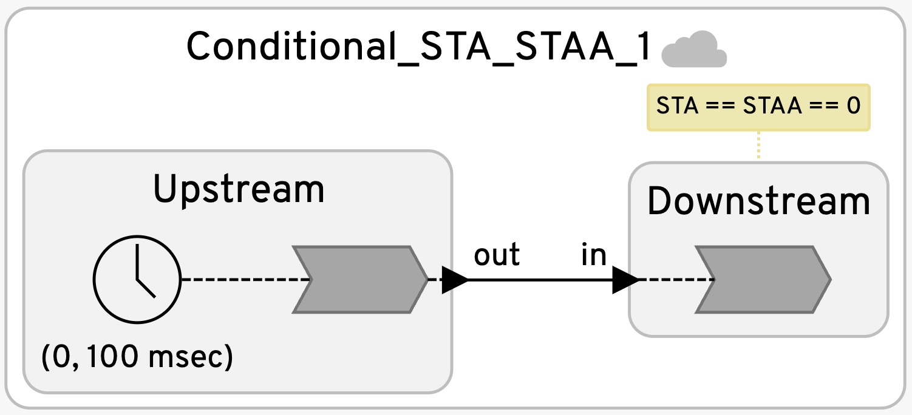
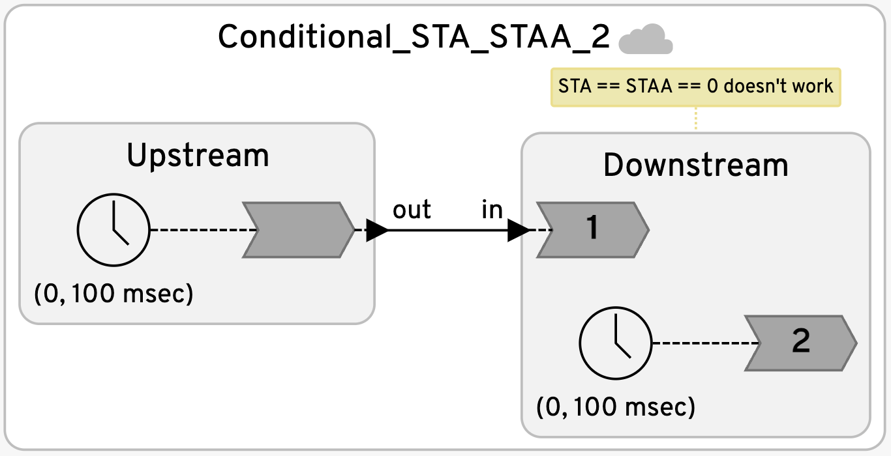
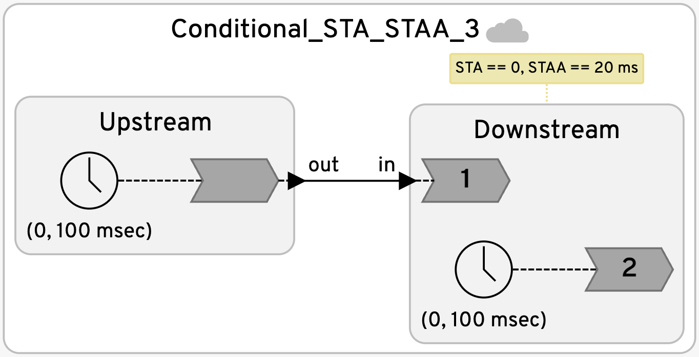
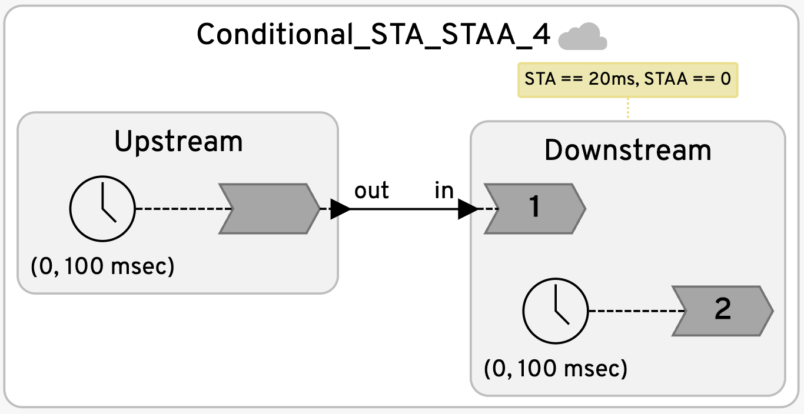
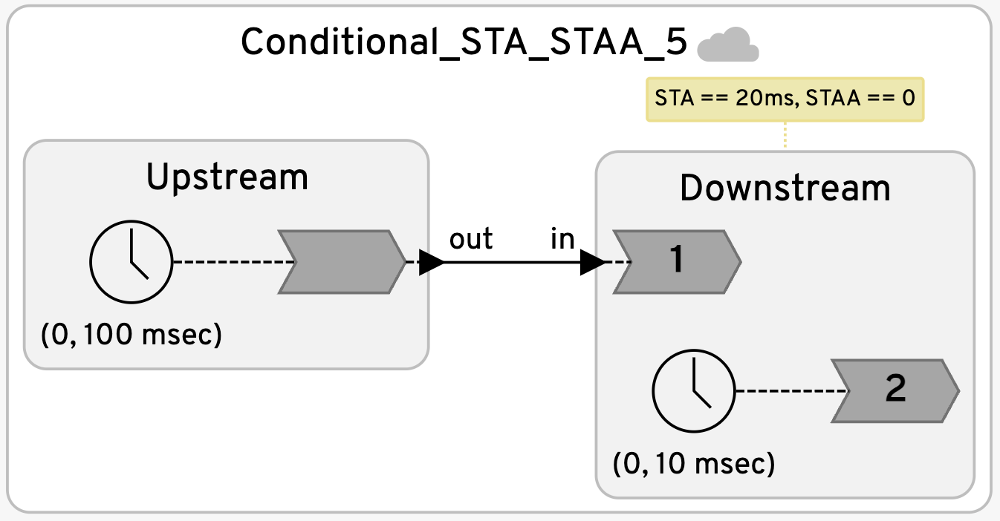
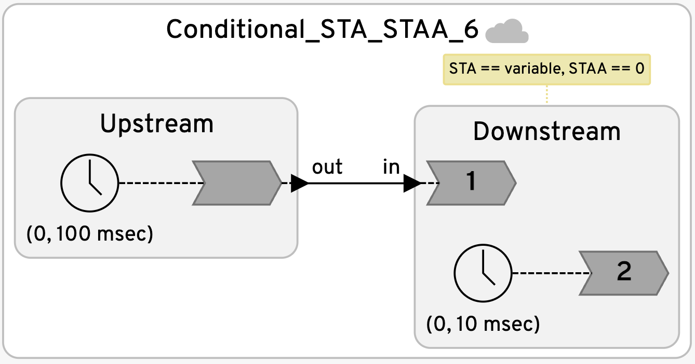

# Distributed STA and STAA

These examples provide guidance for how to choose STA and STAA with federated execution using decentralized coordination. These are all simple feed-forward examples.  They build up to an example where it makes sense to dynamically change the STA at runtime.

<table>
<tr>
<td> 
<td> <a href="Conditional_STA_STAA_1.lf"> Simple situation where STA and STAA are both 0 because the Downstream reactor has
no events to process except input events.</td>
</tr>
<tr>
<td> 
<td> <a href="Conditional_STA_STAA_2.lf"> Variant where zero values for STA and STAA will not work. Safe-to-process
violations occur.</td>
</tr>
<tr>
<td> 
<td> <a href="Conditional_STA_STAA_3.lf"> Fix for the previous example where the STAA (safe-to-assume-absent) is 20 ms.</td>
</tr>
<tr>
<td> 
<td> <a href="Conditional_STA_STAA_4.lf"> Variant where the STA (safe-to-advance) is 20 ms, and the STAA (safe-to-assume-absent) is zero.</td>
</tr>
<tr>
<td> 
<td> <a href="Conditional_STA_STAA_5.lf"> In this variant, the downstream reactor has a timer that triggers much more often than incoming signals. In this case, whenever the local timer triggers at a tag where no input is expected, the system has to wait for the STA+STAA time before it can safely assume that the input is absent.</td>
</tr>
<tr>
<td> 
<td> <a href="Conditional_STA_STAA_6.lf"> This variant eliminates the unnecessary delay in the previous example by setting the STA to 0 until the next time that an input is expected. The ability to set the STA dynamically using knowledge about the program is a powerful feature of the decentralized coordination model.</td>
</tr>
table>
