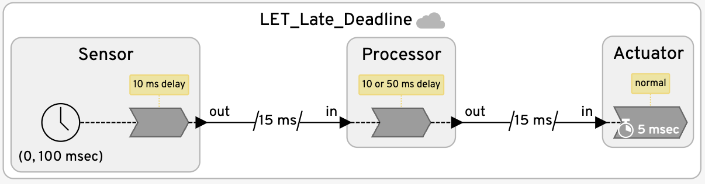
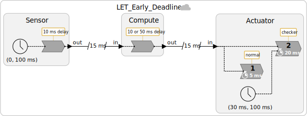

# Distributed Time

These examples show how to create a distributed sensor-processor-actuator chain that provides precise timing when assumptions about latency bounds are met and reacts with fault handlers when the assumptions are not me. In particular, the sequence of examples shows how to use the system-level Logical Execution Time (LET) principle to get more precise timing and how to react early to anomalies that to data arriving too late to be useful.
These example combine the use of deadlines with federated execution using decentralized coordination.

<table>
<tr>
<td> 
<td> <a href="LET_Late_Deadline.lf"> LET_Late_Deadline.lf</a>: This version has a deadline handler at the Actuator that reacts only when inputs arrive, which, for some applications, may be too late.</td>
</tr>
<tr>
<td> 
<td> <a href="LET_Early_Deadline.lf"> LET_Early_Deadline.lf</a>: This version corrects the problem with the above version by providing a handler that gets invoked before late data arrives.</td>
</tr>
</table>
