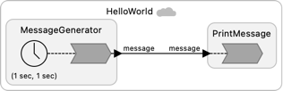
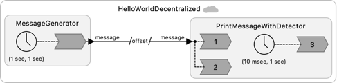
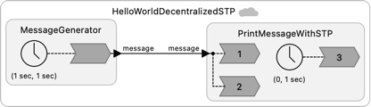
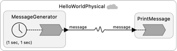
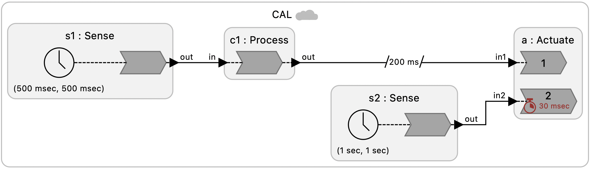
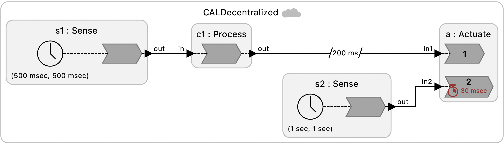

# Distributed Lingua Franca

When intead of a **main reactor** you defined a **federated reactor**, a Lingua Franca program gets divided into multiple programs that execute as separate processes and can execute on different machines. The coordination and communication is automatically generated to preserve LF semantics so that the programs will logically the same as a non-federated program. See [Distributed Execution documentation](https://www.lf-lang.org/docs/handbook/distributed-execution?target=c) for more details.

This directory includes a series of very simple "Hello World" examples.

## Prerequisite

To run these programs, you are required to first [install the RTI](https://www.lf-lang.org/docs/handbook/distributed-execution?target=c#installation-of-the-rti) (the Run-Time Infrastructure), which handles the coordination.

## Examples

<table>
<tr>
<td>  </td>
<td> <a href="HelloWorld.lf"> HelloWorld.lf </a>: A MessageGenerator produces a string and sends it over a network connection to a PrintMessage reactor that prints the message.</td>
</tr>
<tr>
<td>  </td>
<td> <a href="HelloWorldAfter.lf"> HelloWorldAfter.lf </a>: A variant with a logical time delay on the connection.</td>
</tr>
<tr>
<td>  </td>
<td> <a href="HelloWorldDecentralized.lf"> HelloWorldDecentralized.lf </a>: A variant that uses decentralized coordination, which relies and clock synchronization. This version uses an **after** delay.</td>
</tr>
<tr>
<td>  </td>
<td> <a href="HelloWorldDecentralizedSTP.lf"> HelloWorldDecentralizedSTP.lf </a>: A decentralized variant that uses a safe-to-process (STP) offset instead of an **after** delay.</td>
</tr>
<tr>
<td>  </td>
<td> <a href="HelloWorldPhysical.lf"> HelloWorldPhysical.lf </a>: A variant with physical connection.</td>
</tr>
<tr>
<td>  </td>
<td> <a href="HelloWorldPhysicalAfter.lf"> HelloWorldPhysicalAfter.lf </a>: A variant with a physical connection and an **after** delay.</td>
</tr>
<tr>
<td>  </td>
<td> <a href="CAL.lf"> CAL.lf </a>: An illustration of the fundamental tradeoff between consistency, availability, and latency, using centralized control.</td>
</tr>
<tr>
<td>  </td>
<td> <a href="CALDecentralized.lf"> CALDecentralized.lf </a>: An illustration of the fundamental tradeoff between consistency, availability, and latency, using decentralized control.</td>
</tr>
</table>
