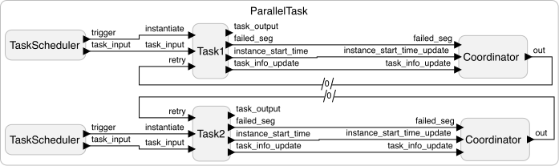
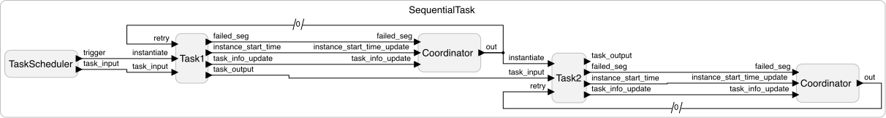
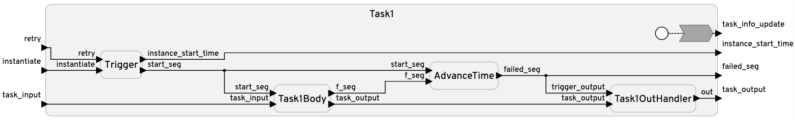

# Fault Tolerant Real-Time Software Examples

This PR introduces a deterministic execution model of fault-tolerant real-time software in Lingua Franca.

## Key Features
### Checkpoint-Based Retry
- Each task is split into multiple segments and saves a checkpoint while execution.
- When the execution fails, it resumes from the last failed segment (checkpoint) on retry.

### Logical Execution Time (LET) Advancement
- Advances logical time by the **wcet_s** for successful segments.
- If a segment fails, LET is advanced by the **wcet_f** of the failed segment.

### Proactive Task Instance Abortion
- Before retrying a failed segment, the system predicts whether the task can finish within its deadline, based on the logical time.
- If the prediction exceeds the deadline, the task is dropped.

## Examples
### `OneTask.lf` - Execution of a single Task
- This example runs a single task, performing checkpointed retries, LET advancement, and proactive abortion.
- The `TaskScheduler` periodically sends a signal to start a task, the `Task` executes, and if the Task fails, the `Coordinator` determines whether to re-execute the task, depending on the deadline, and signals to re-execute from which segment to start.


---

### `ParallelTask.lf` -  Parallel Execution of Tasks
- Adds a second `Task` instance that runs **concurrently** with the first.
- Both tasks perform checkpointed retries, LET advancement, and proactive abortion independently.
- It has different number of segments, WCET, optWCET.


---
### SequentialTask.lf` -  Sequential Execution of Tasks
- Adds a second `Task` that runs **after** the first task finishes.
- The first task's output is passed to the second task's output. 


---

## ROSACE implementation
To show that this template can be used in real tasks, we implement the ROSACE benchmark.
There is already a [current ROSACE implementation](https://github.com/lf-lang/playground-lingua-franca/tree/main/examples/C/src/rosace).
We add two more versions based on the current implementation:
- Adding random failures.
- Adding random failures, and retrying from checkpoints when failed. 
To show that our template can be easily used by using the exact C code as a task, we bring the original C implementation from the [original code](https://svn.onera.fr/schedmcore/branches/ROSACE_CaseStudy/).

# Implementation Details

## Key Reactors.


- `Trigger` :
This triggers the segment to execute. If the `instantiate` port is triggered, execution starts from the first segment. If the `retry` port is triggered, it resumes from the indicated segment number passed by the port.

- `TaskBody` :
This reactor contains user-defined C code for the task inside the preamble. Users can define task-specific inputs and outputs here.

- `AdvanceTime` :
This computes the logical execution time and advances the logical time.

- `TaskOutHandler` (optional) :
This can be added when the task output exists. This ensures that the task output is emitted only when the task succeeds.

- `Coordinator` (not part of the `Task`) :
The `Coordinator` is not part of the `Task`. This reactor manages the proactive task abortion. It receives the segment number to retry from the Task reactor, and determines whether the remaining segments can still meet the deadline. If not, it halts execution early, otherwise, it triggers a retry through the Task reactor.
On startup, the `Task` reactor sends its configuration as a struct of `task_info_t` to the corresponding `Coordinator` reactor. This includes the `task_num`, `dead_line`, `num_of_segs`, `wcet_f`, and `wcet_s`. This is for the modular design to separate the `Task` and the `Coordinator`, and not duplicate the input parameters of the `Task`.

## Usage
To use this, the user needs to `import TaskRetryTemplate, Coordinator from "lib/TaskRetryTemplate.lf"`.
The user then creates a `TaskBody`, and adds their task inside the `preamble`.
The user finally creates a reactor `extend`ing the `TaskRetryTemplate` reactor, and instantiates the `TaskBody`.
Finally, the user should configure the parameters when instantiating the `new Task()`.

### Task Parameters
- The `Task` reactor accepts the following parameters:
  - `task_num`: Task identifier.
  - `dead_line`: Logical time deadline. Different from the LF's deadline as a lag.
  - `num_of_segs`: Number of task segments.
  - `wcet_f`: Array of worst-case execution times of segments in msecs.
  - `wcet_s`: Array of optimized execution times of segments in msecs.
- The user can additionally pass the task's input in the `extend`ing the `TaskBody`, and also set task outputs creating a `TaskOutHandler`.

This is an example how it looks.
```
  task = new Task1<int, int, int>(
      task_num=1,
      dead_line=3000,
      num_of_segs=3,
      wcet_f = {300, 300, 300},
      wcet_s = {250, 250, 250})
```

## Limitation
One limitation is that LF does not support (or maybe cannot) passing function pointers as a `Reactor` input parameter.
The current implementation of this task just uses the `task_number` to link a predefined empty function `total_task'n'`, to the user's implementation.

```
// TaskRetryTemplate.lf
  preamble {=
    int total_task1(int checkpoint);
    int total_task2(int checkpoint);
  =}

  method set_fn_ptr() {=
    if(self->task_num == 1) {
      self->task_fn = total_task1;
    } else if(self->task_num == 2) {
    self->task_fn = total_task2;
    }
  =}
```

Without this, we cannot use different tasks (with different implementations), or else it will give a duplicate definition error on the task.

## Evaluation
There is a directory for evaluation, inside `failing/evaluation`. The `eval.sh` will create `.lf` files for evaluation, compile and execute, and log the results.
It compares three cases, 
- No LET advance, only retrying until deadline misses.
- Advance LET as much as `wcet_f` even if segment succeeds, and do proactive task abortion.
- Advance LET as much as `wcet_f`when segment fails, and `wcet_s` when segment succeeds, and do proactive task abortion.

We compare the Deadline misses, Execution failures, and the Sum of deadline misses and execution failures, and finally CPU utilization.

Graph generation is also possible in the `failing/evaluation/graph_generation` directory.

The Rosace implementation also includes a directory named `rosace/graph_generation`.
It compares the results with and without re-execution based fault-tolerance.
