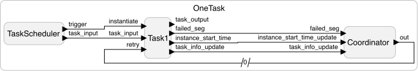

# Fault Tolerant Real-Time Software Examples

The following examples demonstrate modeling and simulation of fault-tolerant real-time software tasks in Lingua Franca.

## OneTask.lf

### Checkpoint-Based Retry
- Each task is split into multiple segments, and execution resumes from the last failed segment (checkpoint) on retry.

### Logical Elapsed Time (LET) Advancement
- Advances logical time by the **optimized execution time (optWCET)** for successful segments.
- If a segment fails, LET is advanced by the **worst-case execution time (WCET)** of the failed segment.

### Predictive Task Dropping
- Before retrying a failed segment, the system predicts whether the task can finish within its deadline.
- If the prediction exceeds the deadline, the task is dropped.



---

## ParallelTask.lf

### Parallel Execution of Tasks
- Adds a second `Task` instance that runs **concurrently** with the first.
- Both tasks perform checkpointed retries, LET advancement, and predictive dropping independently.
- It has different number of segments, WCET, optWCET.


---
## SequentialTask.lf
### Sequential Execution of Tasks
- Adds a second `Task` that runs **after** the first task finishes.
- The deadline of the second task is computed from the _start of the second task_.

---
## Implementation Details

### Modular design
The user needs to `import TaskTemplate, Coordinator, TaskScheduler from "lib/TaskRetryTemplate.lf"`.
The user then creates a reactor `extend`ing the `TaskTemplate` reactor, and add their task inside the preamble.
Finally, the user should configure the parameters when instantiating the `new Task()`.

### Task Parameters
- The `Task` reactor accepts the following parameters:
  - `task_num`: Task identifier.
  - `dead_line`: Logical time deadline. Different from the LF's deadline as a lag.
  - `num_of_segs`: Number of task segments.
  - `wcet`: Array of worst-case execution times in msecs.
  - `optwcet`: Array of optimized execution times in msecs.

### Parameter Sending
- On startup, the `Task` reactor sends its configuration to the corresponding `Coordinator` reactor.

## Limitation
One limitation is that LF does not support (or maybe cannot) passing function pointers as a `Reactor` input parameter.
The current implementation of this task just uses the `task_number` to link a predefined empty function `total_task'n'`, to the user's implementation.

```
// TaskRetryTemplate.lf
  preamble {=
    int total_task1(int checkpoint);
    int total_task2(int checkpoint);
  =}

  method set_fn_ptr() {=
    if(self->task_num == 1) {
      self->task_fn = total_task1;
    } else if(self->task_num == 2) {
    self->task_fn = total_task2;
    }
  =}
```

Without this, we cannot use different tasks (with different implementations), or else it will give a duplicate definition error on the task.