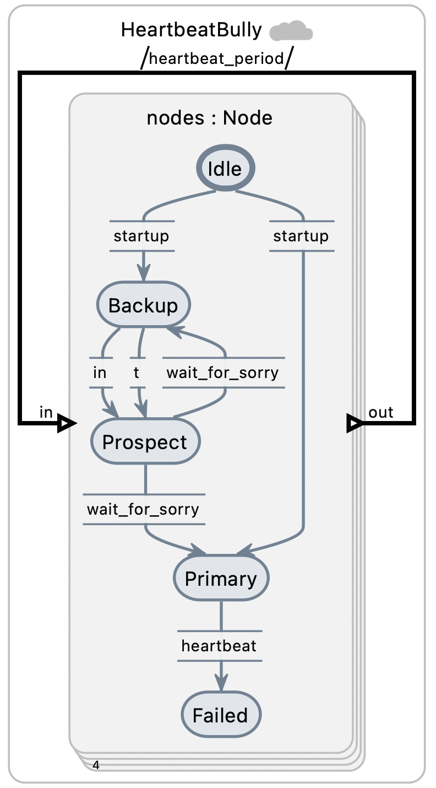
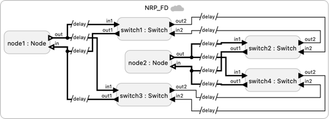
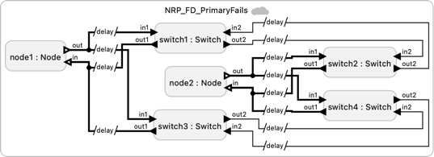
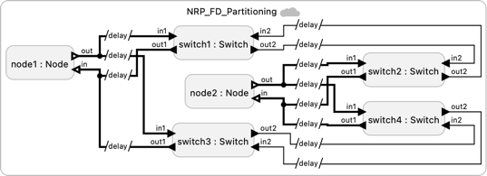
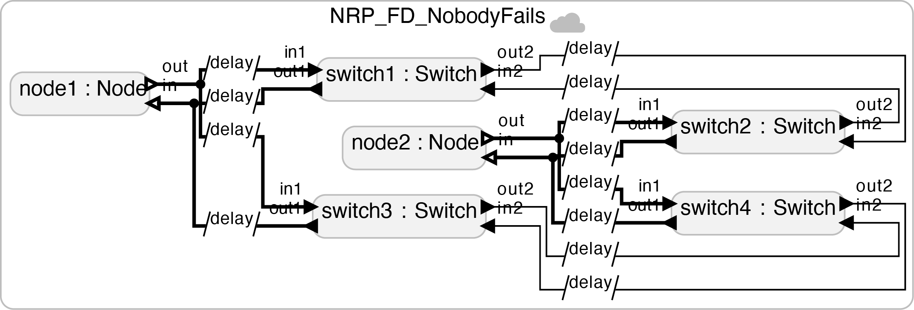
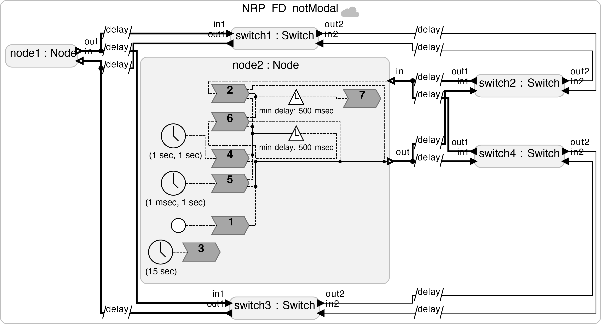

# Leader Election

These federated programs implement redundant fault-tolerant systems where a primary node, if and when it fails, is replaced by a backup node. The HeartbeatBully example is described in this paper:

> B. Johansson, M. Rågberger, A. V. Papadopoulos and T. Nolte, "Heartbeat Bully: Failure Detection and Redundancy Role Selection for Network-Centric Controller," IECON 2020 The 46th Annual Conference of the IEEE Industrial Electronics Society, Singapore, 2020, pp. 2126-2133, [DOI: 10.1109/IECON43393.2020.9254494](https://doi.org/10.1109/IECON43393.2020.9254494).

The NRP examples extend the algorithm to reduce the likelihood of getting multiple primaries when the network becomes partitioned. The NRP protocol is described in this paper:

> B. Johansson, M. Rågberger, A. V. Papadopoulos, and  T. Nolte, "Consistency Before Availability: Network Reference Point based Failure Detection for Controller Redundancy," Emerging Technologies and Factory Automation (ETFA), 12-15 September 2023, [DOI:10.1109/ETFA54631.2023.10275664](https://doi.org/10.1109/ETFA54631.2023.10275664)

The key idea in the NRP protocol is that when a backup fails to detect the heartbeats of a primary node, it becomes primary only if it has access to Network Reference Point (NRP), which is a point in the network. This way, if the network becomes partitioned, only a backup that is on the side of the partition that still has access to the NRP can become a primary. If a primary loses access to the NRP, then it relinquishes its primary role because it is now on the wrong side of a network partition. A backup on the right side of the partition will take over.  The "FD" in the names of the programs stands for "fault detection."

## Prerequisite

To run these programs, you are required to first [install the RTI](https://www.lf-lang.org/docs/handbook/distributed-execution?target=c#installation-of-the-rti) (the Run-Time Infrastructure), which handles the coordination.

## Examples

<table>
<tr>
<td>  </td>
<td> <a href="HeartbeatBully.lf"> HeartbeatBully.lf </a>: Basic leader electrion protocol called "heartbeat bully".</td>
</tr>
<tr>
<td>  </td>
<td> <a href="NRP_FD.lf"> NRP_FD.lf </a>: Extension using a network reference point (NRP) to help prevent multiple primaries. This version has switch1 failing at 3s, node1 failing at 10s, and node2 failing at 15s.</td>
</tr>
<tr>
<td>  </td>
<td> <a href="NRP_FD_PrimaryFails.lf"> NRP_FD_PrimaryFails.lf </a>: This version has the primary (node1) failing after 5 seconds and the backup (node2) failing at at 15s.  The backup detects simultaneous loss of the heartbeat on both networks and hence assumes that the primary has failed rather than there being a network failure. Switch 1 remains the NRP.</td>
</tr>
<tr>
<td>  </td>
<td> <a href="NRP_FD_Partitioning.lf"> NRP_FD_Partitioning.lf </a>: This version partitions the network and shows that the protocol prevents the backup from becoming primary, thereby preventing two primaries.</td>
</tr>
<tr>
<td>  </td>
<td> <a href="NRP_FD_NobodyFails.lf"> NRP_FD_NobodyFails.lf </a>: This version has no failures at all. Use it to manually kill processes.</td>
</tr>
<tr>
<td>  </td>
<td> <a href="NRP_FD_notModal.lf"> NRP_FD_notModal.lf </a>: This version does not use modal models to better align with the Rebeca version on which it is based.</td>
</tr>
</table>
