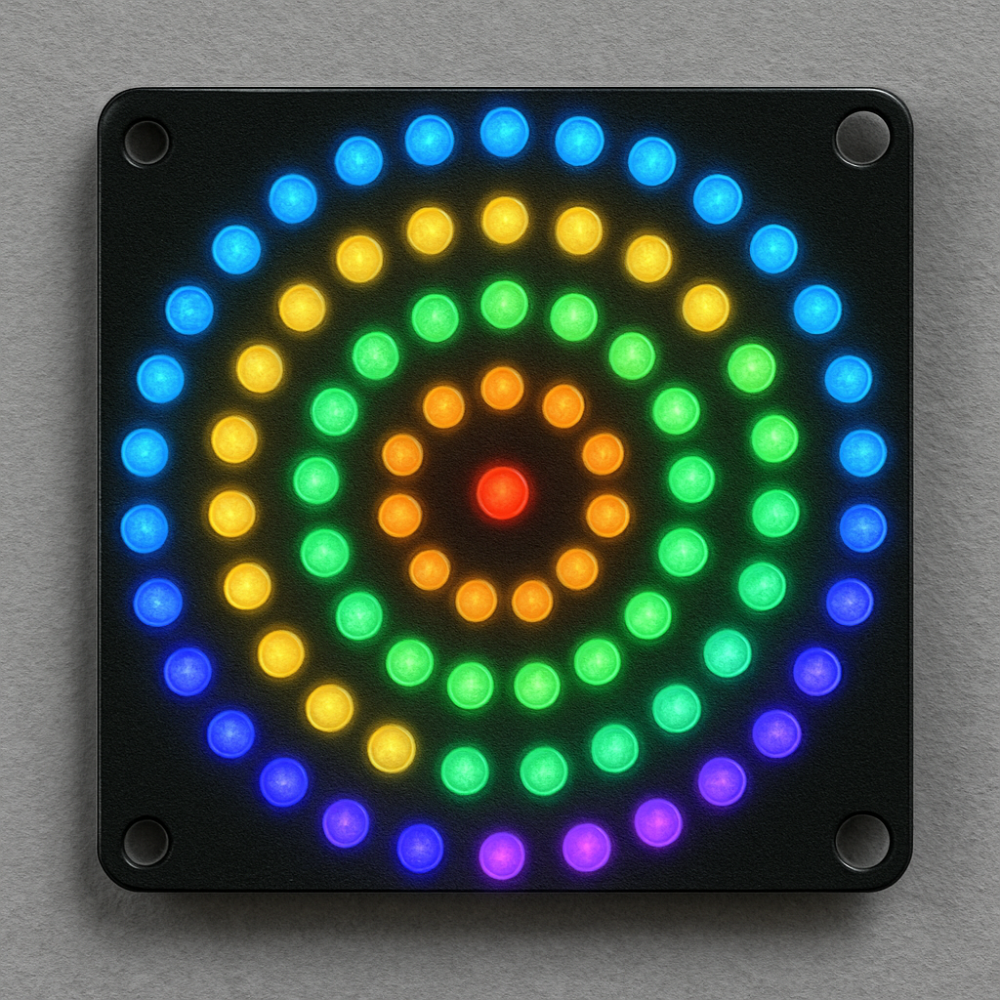
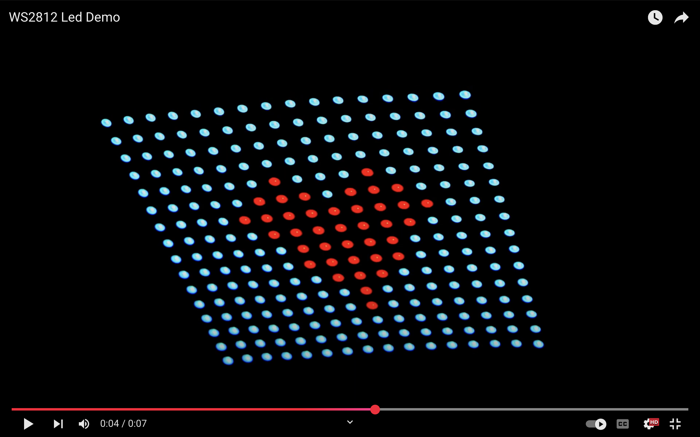
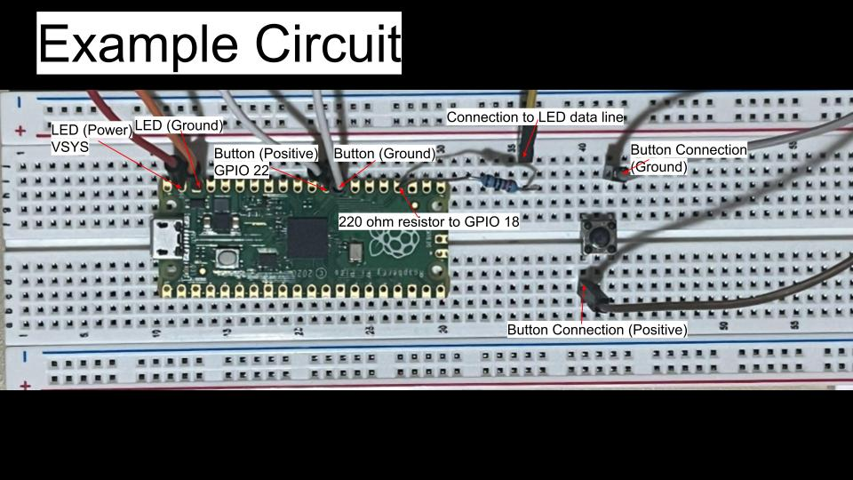
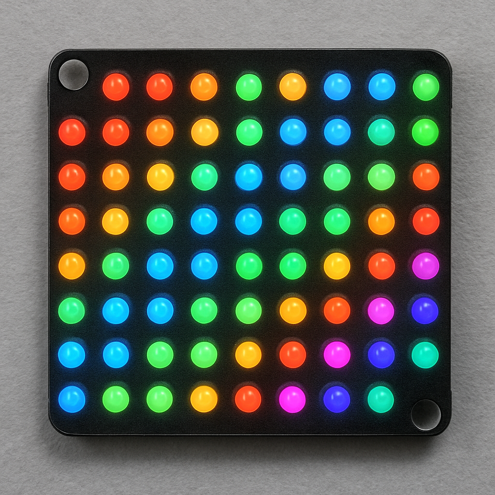
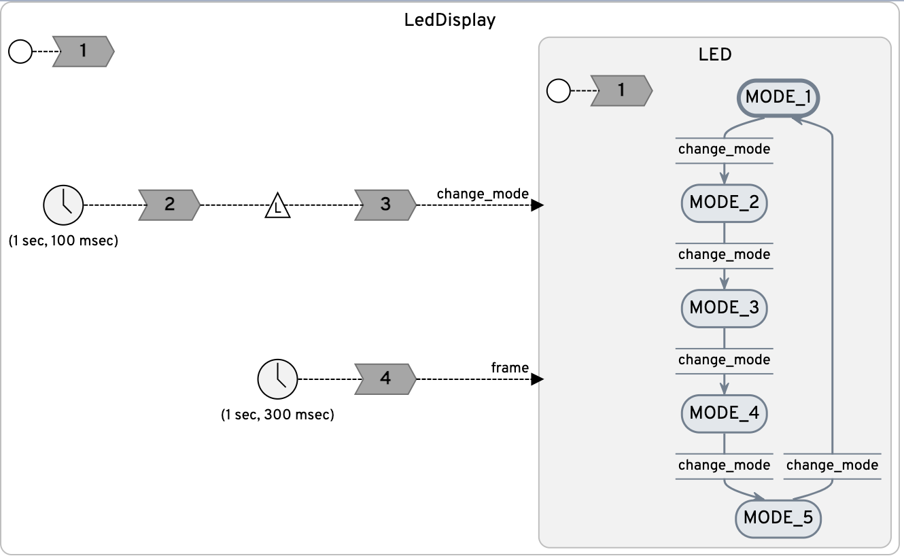

<h1 align="center">
  <br>
  
  <br>
  <br>
  LED Matrix
  <br>
</h1>

<h4 align="center">Interacting with a WS2812 Neopixel LED board using <a href="https://www.lf-lang.org/" target="_blank">Lingua Franca</a>.</h4>

<br>

[](https://www.youtube.com/watch?v=ed-fL5peNKo)


## About the Project

LedDisplay.lf uses a modal model to toggle LED animations which are projected onto a WS2812 Neopixel LED array board. The program depends on Programmable I/O (PIO) to interface with the hardware on the LED array using sub-microsecond timing precision. 

## 1a. **Hardware Requirements**

To build this project, you will need the following components:

- **Raspberry Pi Pico Microcontroller**  
  [Adafruit Product Page](https://www.adafruit.com/pico?src=raspberrypi)

- **Breadboard and Components**
  - 7x Jumper Wires (see connection details below)
  - 220Ω to 330Ω resistor (for the **DIN** line to the LED array)
  - Push Button Switch (used to cycle through LED animation modes)

- **WS2812 Neopixel LED Array Board**  
  [Amazon Product Page](https://www.amazon.com/dp/B07PB2P81N/ref=twister_B07P5TNCHP?_encoding=UTF8&th=1)

---

## 1b. **Software Requirements***

This project requires the pico-sdk to access the hardware/pio/timers on the RP2040 microcontroller. If the pico-sdk isn't in your path, it will be cloned into the /lib directory on build. If there are problems accessing this dependency, ensure that the path exists:

```base
    echo $PICO_SDK_PATH
```

--- 


## 2. **Hardware Setup**



The image above shows a sample breadboard configuration for connecting the WS2812 LED array to a Raspberry Pi Pico microcontroller. This setup includes power, ground, a data input (DIN) line with an in-line resistor, and a push button for mode selection.

Make sure you refer to the official Raspberry Pi Pico datasheet to verify the available GPIO pins. Pin assignments for the LED array (**ws2812**) and the push button (**BUTTON**) should be configured properly in your project’s pin definition file:  
[`lib/src/pins.h`](lib/src/pins.h)

---

## 3. **Project Goal**

This project uses a **modal model** to manage different LED animation behaviors. A **lingua franca timer** is used to periodically poll the button state, allowing the user to switch between animation modes dynamically.

By combining precise control over the WS2812 LED timing with PIO and by using modal logic and responsive input handling, this setup enables a visually engaging and interactive lighting display.


## How To Use

To clone and run this application, you'll need [Git](https://git-scm.com) and [Lingua Franca](https://www.lf-lang.org/docs/installation) installed on your computer. From your command line:

```bash
# Clone this repository
$ git clone https://github.com/lf-lang/playground-lingua-franca.git

# Go into the example folder of the repository
$ cd playground-lingua-franca/examples/C

# Compile the main reactor
$ lfc src/led-matrix/LedMatrix.lf

# Run the program
$ bin/LedMatrix.elf
```

> **Note:**
> Or you can compile and run the program simply using VS Code, [see section "Running Locally"](https://github.com/lf-lang/playground-lingua-franca).


## Component

<table>
<tr>
<td> 
<td> <a href="LedMatrix.lf">LedMatrix.lf</a>: LED contains the modes for the LED matrix. It generates the image patterns and sends the data to the light board.</td>
</tr>
<tr>
<td></td>
<td></td>
</tr>
</table>

## Further Discussion
Initially, the LED matrix driver was based on an existing solution that I adapted to suit the needs of this project. The first implementation, in C, performed reliably and communicated effectively with the WS2812 LED panel.

However, issues arose after translating the C implementation into a lingua franca program using reactors. Despite seeming to maintain logical equivalence, the driver began to fail. After extensive debugging, it became apparent that the problem stemmed from disruptions in the timing protocol required by the WS2812 LEDs. These LEDs rely on extremely precise timing to differentiate between logical high and low signals, with tolerances on the order of a few hundred nanoseconds.

Achieving this level of timing precision in software alone proved unreliable and impractical. To address this, I transitioned to using the Raspberry Pi Pico's Programmable I/O (PIO) subsystem for signal generation. The PIO allows for deterministic, low-level control over signal timing and is well-suited for protocols with strict temporal requirements like that of the WS2812.

Fortunately, the official pico-examples repository includes a PIO implementation for driving WS2812 LEDs. By integrating this into the project, I was able to restore reliable operation and ensure consistent communication with the LED matrix.

If you have any insight on why the lingua franca might mess with the timing protocol of my original driver I would love to hear about it. 

For any inquiries on this project please email me (Benjamin Gunnels, @ben-gunnels) at: bengunnels8@gmail.com
