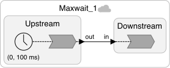
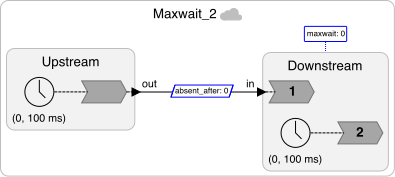
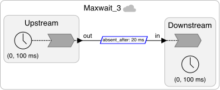
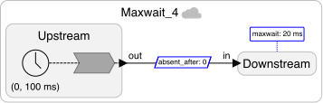
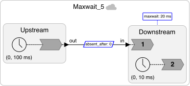

# Distributed `maxwait` and `absent_after`

These examples provide guidance for how to choose `maxwait` and `absent_after` with federated execution using decentralized coordination. These are all simple feed-forward examples.  They build up to an example where it makes sense to dynamically change the `maxwait` at runtime.

<table>
<tr>
<td> </td>
<td> <a href="Maxwait_1.lf"> Maxwait\_1.lf</a>: Simple situation where `maxwait` and `absent_after` do not matter because the reactors only ever have one event to process.</td>
</tr>
<tr>
<td> </td>
<td> <a href="Maxwait_2.lf"> Maxwait\_2.lf</a>: Variant where zero values for `maxwait` and `absent_after` will not work. Safe-to-process
violations occur.</td>
</tr>
<tr>
<td> </td>
<td> <a href="Maxwait_3.lf">Maxwait\_3.lf</a>: Fix for the previous example where `absent_after` is 20 ms.</td>
</tr>
<tr>
<td> </td>
<td> <a href="Maxwait_4.lf">Maxwait\_4.lf</a>: Variant where `maxwait` is 20 ms, and `absent_after` is zero.</td>
</tr>
<tr>
<td> </td>
<td> <a href="Maxwait_5.lf">Maxwait\_5.lf</a>: In this variant, the downstream reactor has a timer that triggers much more often than incoming signals. In this case, whenever the local timer triggers at a tag where no input is expected, the system has to wait for  `maxwait`+`absent_after` time before it can safely assume that the input is absent.</td>
</tr>
<tr>
<td> </td>
<td> <a href="Maxwait_6.lf">Maxwait\_6.lf</a>: This variant eliminates the unnecessary delay in the previous example by setting `maxwait` to 0 until the next time that an input is expected. The ability to set `maxwait` dynamically using knowledge about the program is a powerful feature of the decentralized coordination model.</td>
</tr>
table>
