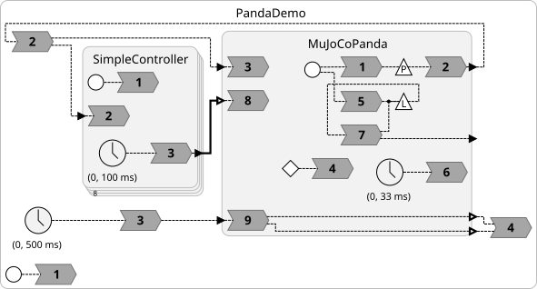

# Mujoco Robot Simulation

This directory shows how to use the `mujoco-c` package, subclassing the base classes provided there to realize
simulations of robots defined in the `mujoco_menagerie` submodule.

## Prerequisites

[MuJoCo](https://mujoco.org) (Multi-Joint dynamics with Contact) is a physics-based simulation engine with graphics and animation for the Python target. To install MuJoCo, see the [mujoco-c package documentation](https://github.com/lf-lang/mujoco-c).

## Programs

<table>
<tr>
<td> 
<td> <a href="PandaDemo.lf"> PandaDemo.lf</a>: Simulation of the Frank Emika Panda going through its motions. This demo also illustrates how to read a parameter file (CSV format) to set parameters.</td>
</tr>
</table>
