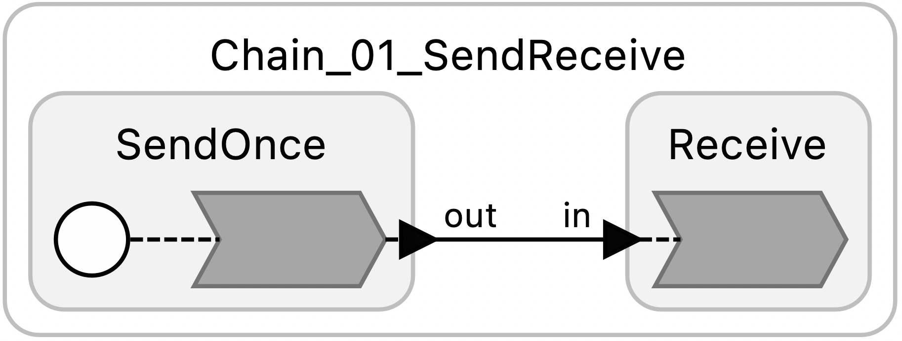
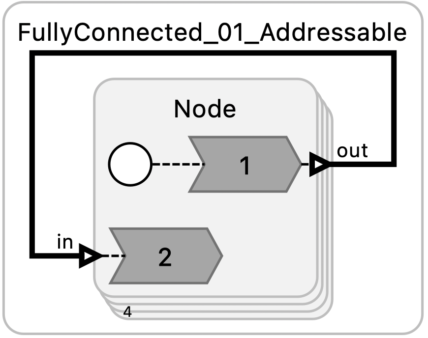

# Patterns

This directory contains Lingua Franca programs representing a number of common design patterns. The naming convention is that each example is in a file named Class_Num_Description.lf, where Class identifies a class of patterns (Chain, Loop, etc.), the Num is a two digit number suggesting the order in which to look at the examples, and Description is a short hint at what particular variant of the pattern the program represents.

## Examples

<table>
<tr>
<td>  </td>
<td> <a href="Chain_01_SendReceive.lf">Chain_01_SendReceive.lf</a>: Very simple two-reactor chain. </td>
</tr>
<tr>
<td>  </td>
<td> <a href="Chain_02_Pipeline.lf"> Chain_02_Pipeline.lf</a>: Using a bank to create pipeline. </td>
</tr>
<tr>
<td>  </td>
<td> <a href="FullyConnected_00_Broadcast.lf"> FullyConnected_00_Broadcast.lf</a>: A bank of reactors that broadcast to all others. </td>
</tr>
<tr>
<td>  </td>
<td> <a href="FullyConnected_01_Addressable.lf"> FullyConnected_01_Addressable.lf</a>: A bank of reactors that selectively send to each other. </td>
</tr>
<tr>
<td>  </td>
<td> <a href="Loop_01_Single.lf"> Loop_01_Single .lf</a>: A single reactor sends data to itself. </td>
</tr>
<tr>
<td>  </td>
<td> <a href="Loop_02_SingleDelay.lf"> Loop_02_SingleDelay.lf</a>: A single reactor sends data to itself with delay. </td>
</tr>
<tr>
<td>  </td>
<td> <a href="Simultaneity.lf"> Simultaneity.lf</a>: An illustration of logical simultaneity. </td>
</tr>
</table>

## Library

These programs reuse a collection of library reactors contained in the [lib](lib) subdirectory:

* [SendersAndReceivers](lib/SendersAndReceivers.lf): A collection of reactors that send and receive data.
* [TakeTime](lib/TakeTime.lf): Perform computation for a specified amount of physical time.

If you add to these patterns, please use or extend the library reactors rather than just creating new reactors with similar functionality. Please also fully document your patterns. What do they illustrate? How can the user experiment with them? Also, for each pattern, please add a test in the test subdirectory. Tests should use corresponding test receivers in the lib directory.