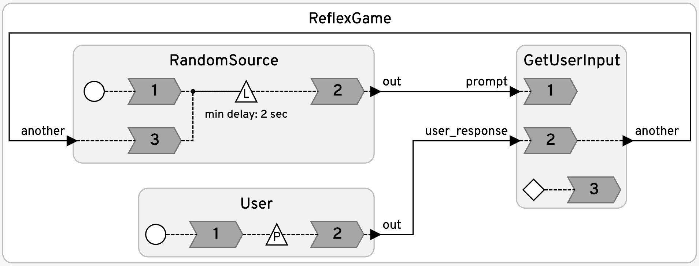
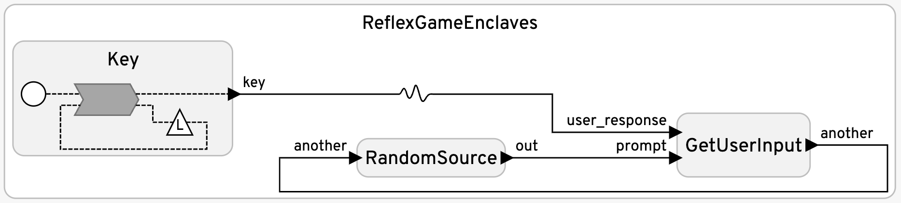

# Reflex Game

These examples illustrate the use of logical and physical actions, asynchronous external inputs, the use of startup and shutdown reactions, the use of actions with values, and the use of enclaves instead of threads to allow reactions that block on user input.

<table>
<tr>
<td> 
<td> <a href="ReflexGame.lf"> ReflexGame.lf</a>: This version starts a background thread in a startup reaction. The thread function is defined in the preamble.</td>
</tr>
<tr>
<td> 
<td> <a href="ReflexGameEnclaves.lf"> ReflexGameEnclaves.lf</a>: This version uses an enclave with a reaction that blocks on user input.</td>
</tr>
</table>
