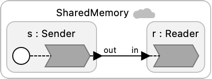

# Shared Memory

The POSIX Realtime Extension includes a mechanism for processes on a single machine to share memory.  A writer opens a "file" using `shm_open` and then uses `mmap` to map a sequence of memory addresses to the contents of this in-memory file. The `mmap` function returns a pointer to this memory, which the writer can then use to store data.

A reader needs only the file name to open the file using `shm_open`, which it can then also map to memory locations using `mmap`

This example shows how you can safely use this mechanism to exchange large chunks of data between LF federates without serializing, streaming, and then deserializing the data.  The Sender reactor creates a file name using the current logical time (to ensure  uniqueness, assuming no use of microsteps).  It populates the shared memory with data and then sends the filename to the Reader.  The Reader will only receive the file name after the Sender has finished writing to it, so precedence constraints are satisfied.

<table>
<tr>
<td> 
<td> <a href="SharedMemory.lf"> SharedMemory.lf</a>: An illustration of how to use shared memory to exchange large chunks of data between federates.</td>
</tr>
</table>