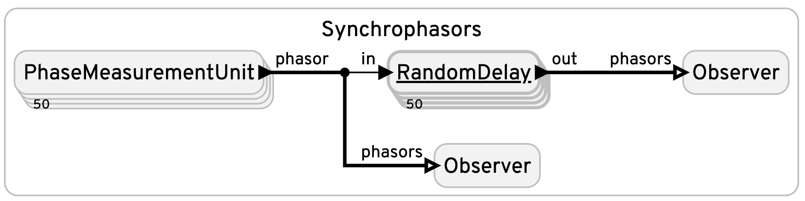

# Synchrophasors

This program simulates a set of phase measurement units (PMUs) connected to two observers, each of which relays the data to a web page. The first observer is connected directly to the PMUs.
The second observer is connected to the PMUs via a RandomDelay reactor, which simulates a physical connection (which discards the timestamp) with a random delay. The data provided to the
two observers is plotted on a web page.

The program illustrates the value of timestamping data. The first observer displays clean data that clearly shows a fault at PMU number 42.
The second observer displays noisy data that obscures the fault.

<table>
<tr>
<td> 
<td> <a href="Synchrophasors.lf"> Synchrophasors.lf</a>: Display clean and noisy observations of synchrophasor data.  When the program is running, you can point your browser to <a href="http://localhost:8080">http://localhost:8080</a> to get a page.</td>
</tr>
</table>
