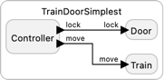
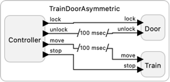
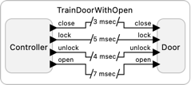

# Train Door

These programs model a verification problem considered in [Sirjani, et al., Verification of Cyberphysical Systems](https://www.mdpi.com/2227-7390/8/7/1068). The problem concens a train door controller that must be closed and locked while the train is moving.

<table>
<tr>
<td>  </td>
<td> <a href="TrainDoorSimplest.lf"> TrainDoorSimplest.lf</a>: An interactive controller with two commands, "lock and move" and "stop and unlock".</td>
</tr>
<tr>
<td>  </td>
<td> <a href="TrainDoor.lf"> TrainDoor.lf</a>: This version has two components: one that controls the door and one that senses motion. When the door controller receives a request to open the door (a button press), it has to first check whether the vehicle was recently in motion. The request will be denied if motion has been detected less than two seconds ago.</td>
</tr>
<tr>
<td>  </td>
<td> <a href="TrainDoorAsymmetric.lf"> TrainDoorAsymmetric.lf</a>: This version accepts two commands, one to "lock and move" and one to "stop and unlock" and uses after delays to ensure that these occur in the right order.</td>
</tr>
<tr>
<td>  </td>
<td> <a href="TrainDoorWithDeadlines.lf"> TrainDoorWithDeadlines.lf </a>: This version adds deadlines to ensure that the ordering is enforced in physical time.</td>
</tr>
<tr>
<td>  </td>
<td> <a href="TrainDoorWithOpen.lf"> TrainDoorWithOpen.lf </a>: This version adds only checks the order of lock, unlock, open, and close commands.</td>
</tr>
</table>