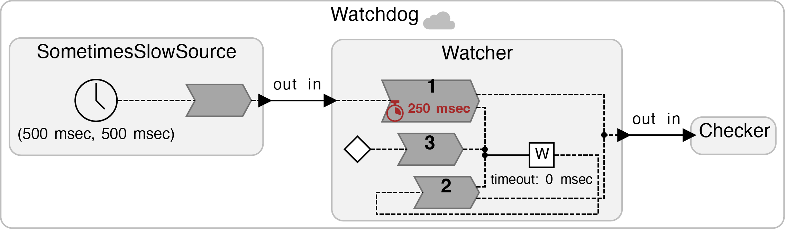

# Watchdog -- Reacting to Absent Inputs

The LF deadline handlers react to inputs that are late.
What if you want to react the fact that an input has _not_ arrived by a certain time?
The deadline construct, by itself, will not do this.
It does not react until an input actually arrives.

The watchdog construct provides a mechanism for this.
A watchdog is started using `lf_watchdog_start` at some logical time _t_.
It will expire at _physical_ time _t_ + _W_, where _W_ is the watchdog delay,
unless it gets restarted with `lf_watchdog_start` or stopped using `lf_watchdog_stop`
before that physical time elapses.

When a watchdog expires, two things happen. First, the watchdog handler is invoked.
Second, an event identified by the name of the watchdog is scheduled to execute at the logical time of the watchdog expiration.
The watchdog handler is invoked asynchronously, and therefore has limited access
to the reactor's infrastructure, such as inputs and outputs.
However, the scheduled watchdog event can trigger an ordinary reaction
which has full access to the state variables and inputs and outputs of the reactor.

<table>
<tr>
<td> 
<td> <a href="Watchdog.lf">Watchdog.lf</a>: Illustration of the use of the watchdogs in LF.</td>
</tr>
</table>