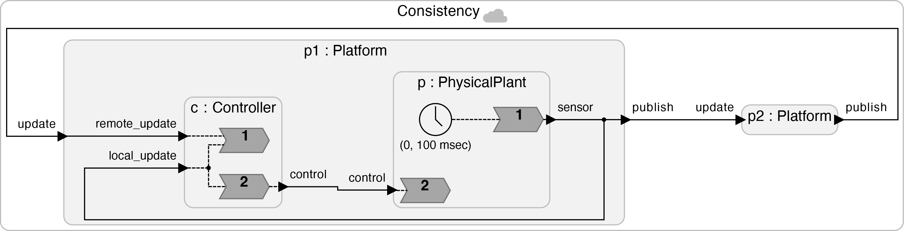
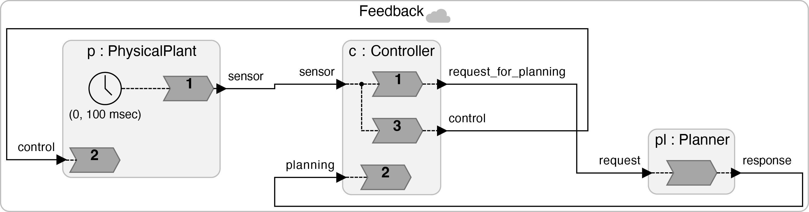
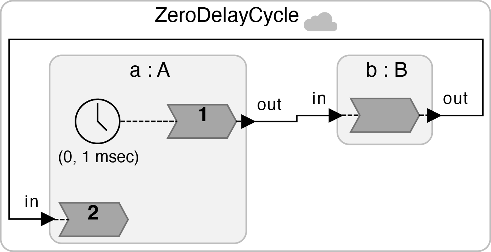

# Zero-delay Cycles

These examples show usage patterns for zero-delay cycles in Lingua Franca.

<table>
<tr>
<td> 
<td> <a href="Consistency.lf">Consistency.lf</a>: Symmetric control system with two controllers that need to take actions on a physical plant based on consistent information.</td>
</tr>
<tr>
<td> 
<td> <a href="Feedback.lf">Feedback.lf</a>: Feedback controller coupled with supervisory controller.</td>
</tr>
<tr>
<td> 
<td> <a href="ZeroDelayCycle.lf">ZeroDelayCycle.lf</a>: Trivial test case.</td>
</tr>
</table>
