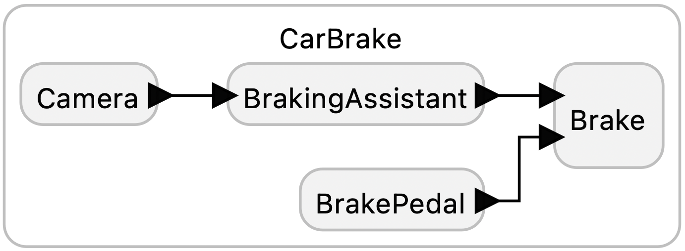
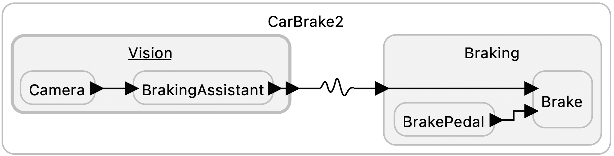

# Car Brake Example

This example illustrates a fundamental tradeoff between consistency and availability as explained in this paper:

> E. A. Lee, R. Akella, S. Bateni, S. Lin, M. Lohstroh, and C. Menard, "Consistency vs. Availability in Distributed Real-Time Systems," arXiv:2301.08906 [cs.DC], January 21 2023. [Online]. Available: [https://arxiv.org/abs/2109.07771](https://arxiv.org/abs/2109.07771).

The scenario is an ADAS system (advanced driver assistance system), where images from a forward looking camera are analyzed and may result in a command to sent to a car's braking system.
These programs are sketches in that no actual image analysis or braking is performed, but rather image analysis is simulated by a reaction that sleeps for some time, emulating significant computation time.
The code sleeps for 10ms in our hypothetical example.

In the first version, a deadline violation in a car brake can be triggered when the driver presses the brake pedal and the system is busy analyzing an image generated at a slightly earlier logical time.

The second version forsakes consistency altogether using a Lingua Franca physical connection, which discards timestamps. In this simple example, this is possibly a reasonable implementation. However, more generally, designs like this where components simply react to the most recent inputs, are deprecated because of the difficulty in testing them. See, for example, [Koopman](https://betterembsw.blogspot.com/2014/09/a-case-study-of-toyota-unintended.html).

## Variant that fixes this

The CarBrake2.lf variant decouples the vision system from the handling of brake pedal actions
in a way that makes it impossible for the vision system to have any effect on the ability of the other component
to make deadlines. The price for this decoupling is added nondeterminacy because the physical connection
reassigns time stamps based on the current physical clock.

<table>
<tr>
<td> 
<td> <a href="CarBrake.lf">CarBrake.lf</a>: Sketch of an ADAS implementation that emphasizes strong consistency at the expense of availability and therefore will miss deadlines when the brake pedal is pushed while image analysis is being performed.</td>
</tr>
<tr>
<td> 
<td> <a href="CarBrake2.lf">CarBrake.lf</a>: Variant that decouples the vision system from the handling of the brake pedal using a physical connection.</td>
</tr>
</table>