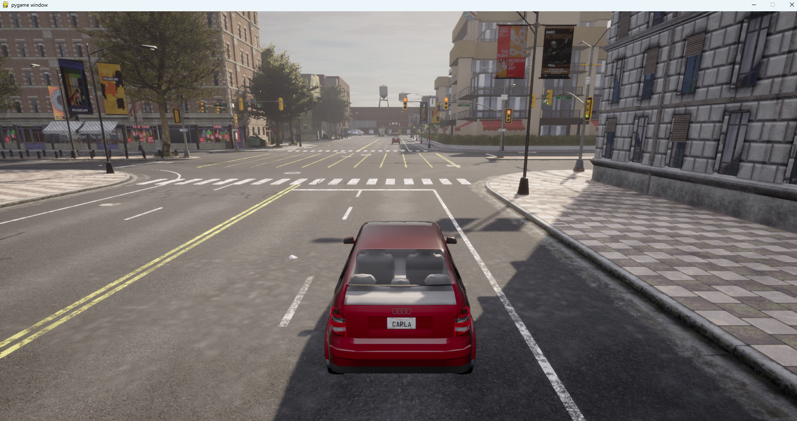

# CARLA

This guide provides detailed instructions for running the CARLA simulator with LF. Ensure the following prerequisites are met before proceeding with the installation:

- **System requirements.** CARLA is built for Windows and Linux systems.
- **An adequate GPU.** CARLA aims for realistic simulations, so the server needs at least a 6 GB GPU although we would recommend 8 GB. A dedicated GPU is highly recommended for machine learning.
- **Disk space.** CARLA will use about 20 GB of space.
- **Two TCP ports and good internet connection.** 2000 and 2001 by default. Make sure that these ports are not blocked by firewalls or any other applications.
- **Other requirements.** CARLA requires some Python dependencies. Install the dependencies with the following command:

```bash
pip3 install --user pygame numpy carla
```

### **Downloading CARLA**

Download CARLA version 0.9.15 from [the official repository](https://github.com/carla-simulator/carla/releases/tag/0.9.15/). Extract the release file, which contains a precompiled version of the simulator.

### **Running the CARLA Server**

1. **On Windows:** Navigate to the extracted CARLA folder and double-click the `CarlaUE4.exe` file to start the server. A window will appear indicating the server is active.
2. **On Linux:** In the terminal, navigate to the CARLA folder and run `./CarlaUE4.sh` to initiate the server.

Note: Please restart the CARLA Server before running each of the examples below.

### **Compiling LF**

Compile the `carla_manual_control.lf` and `carla_circle.lf` using the `lfc` command.

### Synchronous Example - Manual Control

Run the generated script `/.carla_manual_control` which connects to the CARLA server in synchronous mode and initiates a driving simulator in pygame. Use ARROWS or WASD keys for control. Image and IMU data will be displayed on the console.



### Asynchronous Example - Driving in Circles

Run the generated script `/.carla_circles` which connects to the CARLA server in asynchronous mode and initiates a driving simulator in pygame. The vehicle will drive in circles. Image and IMU data will be displayed on the console.


### Possible Configurations of CARLA Server

The configuration of time-step and synchrony, leads for different settings. Here is a brief summary on the possibilities.

|                   | Fixed time-step                                                        | Variable time-step                 |
| ----------------- | ---------------------------------------------------------------------- | ---------------------------------- |
| Synchronous mode  | Client is in total control over the simulation and its information.    | Risk of non reliable simulations.  |
| Asynchronous mode | Good time references for information. Server runs as fast as possible. | Non easily repeatable simulations. |

- **Synchronous mode + variable time-step.** This is almost for sure a non-desirable state. Physics cannot run properly when the time-step is bigger than 0.1s, and if the server has to wait for the client to compute the steps, this is likely to happen. Simulation time and physics will not be in synchrony. The simulation will not be reliable.
- **Asynchronous mode + variable time-step.** This is the default CARLA state. Client and server are asynchronous. The simulation time flows according to the real time. Reenacting the simulation needs to take into account float-arithmetic error, and possible differences in time steps between servers.
- **Asynchronous mode + fixed time-step.** The server will run as fast as possible. The information retrieved will be easily related with an exact moment in the simulation. This configuration makes possible to simulate long periods of time in much less real time, if the server is fast enough.
- **Synchronous mode + fixed time-step.** The client will rule the simulation. The time step will be fixed. The server will not compute the following step until the client sends a tick. This is the best mode when synchrony and precision is relevant, especially when dealing with slow clients or different elements retrieving information.

**Fixed time-step**

Fixed delta seconds can be set in the world settings.

```python
settings = world.get_settings()
settings.fixed_delta_seconds = 0.05
world.apply_settings(settings)
```

**Variable time-step**

The default mode in CARLA. The simulation time that goes by between steps will be the time that the server takes to compute these.

```python
settings = world.get_settings()
settings.fixed_delta_seconds = None # Set a variable time-step
world.apply_settings(settings)
```
