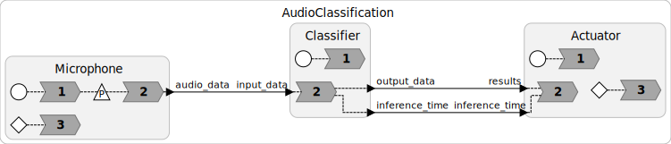
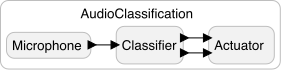

# Audio Classification Example

This example demonstrates the implementation of audio classification in Lingua Franca, utilizing the [Tensorflow Lite API](https://www.tensorflow.org/lite). Specifically, it showcases the functionality of an Emergency Sirens Classifier, capable of real-time classification of three distinct classes: Ambulance, Firetruck, and Traffic.

## Example Description

The example comprises three reactors:
- **Microphone**: Responsible for capturing real-time audio input data frames and forwarding them to the Classifier reactor for classification.
- **Classifier**: This reactor loads the TensorFlow Lite model. Upon receiving audio data from the Microphone reactor, it executes the classification task and forwards the output to the Actuator reactor.
- **Actuator**: Responsible for receiving the classification results and displaying them on the terminal. Additionally, to improve classification accuracy, the Actuator reactor computes a mean classification result over a predefined number of iterations, typically every three iterations.



## Running Locally

Before cloning this repository, you need to install and configure [Git LFS](https://git-lfs.github.com/) to handle large files. Follow the [installation instructions](https://docs.github.com/en/github/managing-large-files/installing-git-large-file-storage) to set up Git LFS on your system. 

Once Git LFS is installed, you can clone the repository:

```bash
git clone https://github.com/lf-lang/playground-lingua-franca.git
```

### Install Dependencies

The example requires several Python packages, including:

- `sounddevice`
- `numpy`
- `tensorflow`

To install the dependencies:

1. Navigate to the example directory:

    ```bash
    cd examples/Python/src/AudioClassification
    ```

2. Install the required packages:

    ```bash 
    python3 -m pip install -r requirements.txt
    ```

This will install all the packages listed in `requirements.txt`.
> [!WARNING] 
> Be sure that you are using the same Python version as Lingua Franca for building the program.

#### Installing Tensorflow for Apple Silicon

Installing TensorFlow for Apple Silicon can be a bit challenging. Therefore, it's important to follow this guide closely. First, ensure you update your **Xcode Command Line Tools**. Open your terminal and execute the following command:

```bash
xcode-select --install
```

After the installation finishes, you'll need to set up a package manager like [Homebrew](https://brew.sh/). Refer to the website for installation instructions.

Once you've successfully installed both **Xcode Command Line Tools** and **Homebrew Package Manager**, proceed with the following instructions:

1. Install the `hdf5` package using Homebrew:
    ```bash
    brew install hdf5
    ```

2. Install the necessary packages:
   ```bash
   python3 -m pip install -r requirements_apple_silicon.txt
   ```
> [!WARNING]  
> Make sure to check the versions of the packages listed in the `requirements_apple_silicon.txt` file, as they may have been updated by the time of your installation. The current versions listed in the file have been tested under Python 3.9.

3. Finally, install TensorFlow for MacOS:
    ```bash
    python3 -m pip install tensorflow-macos
    python3 -m pip install tensorflow-metal
    ```

## Troubleshooting

### Error installing packages

If you are facing issues while installing the `h5py` package, you can try the following steps:

1. Remove the following line from `requirements_apple_silicon.txt`:
   
    ```bash
    h5py>=3.6.0,<3.7
    ```
2. Then, execute again the command:
   
    ```bash
    python3 -m pip install -r requirements_apple_silicon.txt
    ```
> [!WARNING]  
> Make sure to check the versions of the packages listed in the `requirements_apple_silicon.txt` file, as they may have been updated by the time of your installation. The current versions listed in the file have been tested under Python 3.9.

### Python version

To successfully install and execute TensorFlow, it's recommended to use Python 3.9. However, the `CMAKELists.txt` file is configured to search for a version of Python between `3.10.0` and `<3.11.0`. To resolve this issue, you'll need to manually modify the `CMAKELists.txt` file after compiling the Lingua Franca program, followed by rebuilding the program. Here's how you can do it:

1. Navigate to the following path: `AudioClassification/src-gen/AudioClassification`.
2. Open the `CMAKELists.txt` file.
3. Locate the line:

   ```cmake
   find_package(Python 3.10.0...<3.11.0 REQUIRED COMPONENTS Interpreter Development)
   ```

4. Modify it to:

   ```cmake
   find_package(Python 3.9.0...<3.10.0 REQUIRED COMPONENTS Interpreter Development)
   ```
> [!NOTE]
> You can also use a version lower than 3.9 but not greater than 3.10, as TensorFlow may encounter execution errors otherwise.

Once you've made these changes, proceed to rebuild the program. Follow these steps:

1. Open the terminal and ensure you're in the directory `AudioClassification/src-gen/AudioClassification`.
2. Execute the following commands:

   ```bash
   rm -rf build && mkdir -p build && cd build && cmake .. && make && cd ..
   ```

After the build process is complete, you can now execute the Lingua Franca Program directly using Python. Make sure you're in the directory `AudioClassification/src-gen/AudioClassification`, and then run the following command:

```bash
python3 AudioClassification.py
```


## Programs

<table>
<tr>
<td> 
<td> <a href="AudioClassification.lf">AudioClassification.lf</a>: Audio classification using Tensflow Lite.</td>
</tr>
</table>
