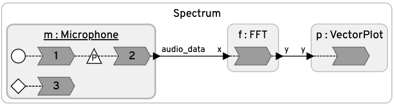

# Audio
This demo illustrates the use of live audio input and interactive plotting in the Python target.

## Installation

Required packages:

```
pip3 install numpy sounddevice matplotlib
```

## Programs

<table>
<tr>
<td> 
<td> <a href="Spectrum.lf">Spectrum.lf</a>: Displays live spectrum of microphone audio input. This illustrates how to retrieve audio input and how to create live plots.</td>
</tr>
</table>
