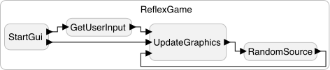
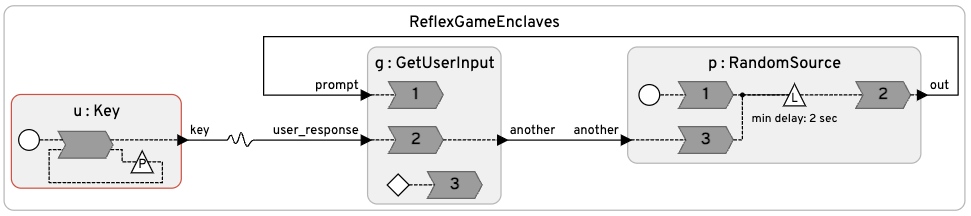

# Reflex Game
Two implementations of the reflex game demo are given here, one that uses ordinary command-line inputs ([ReflexGameEnclaves.lf](ReflexGameEnclaves.lf)) and the other ([ReflexGame.lf](ReflexGame.lf)) that uses Pygame to construct a graphical user interface.
The logic in this demo is heavily modeled after the reflex game of C/C++ targets.

## Installation

To get the Pygame example to work, you will need to install pygame:

```
pip3 install pygame
```

## Programs

<table>
<tr>
<td> 
<td> <a href="ReflexGame.lf"> ReflexGame.lf</a>: Reflex game with a graphical user interface, illustrating how to use Pygame with Lingua Franca.</td>
</tr>
<tr>
<td> 
<td> <a href="ReflexGameEnclaves.lf"> ReflexGameEnclaves.lf</a>: Reflex game using ordinary command-line inputs, illustrating how to use enclaves in Lingua Franca to invoke reactions that block on user input.</td>
</tr>
</table>
