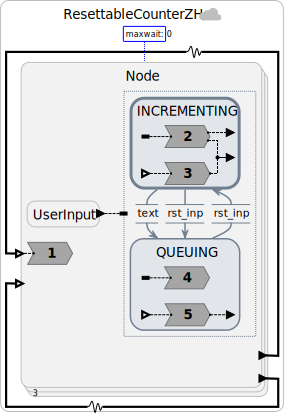
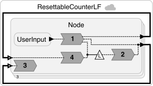
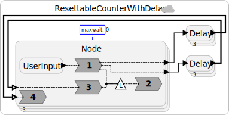

# Resettable Counter

A [video explaining an earlier version of this example](https://drive.google.com/file/d/17aC1IOt1dp_Bv19r0VFGDpO0tn0PW7ze/view?usp=sharing) is available.

Two implementations of distributed counter that requires no coordination except when a reset is requested.
This illustrates the use of [CRDTs](https://pages.lip6.fr/Marc.Shapiro/papers/RR-7687.pdf) (conflict-free replicated datatypes), which are data structures that can be updated by multiple nodes without coordination.
Equivalently, these are replicated data structures with [ACID 2.0](https://doi.org/10.48550/arXiv.0909.1788) (associative, commutative, idempotent, and distributed) merge operations.
In this case, the CRDT is extended with a non-commutative operation (reset to zero).

In this example, three nodes maintain private copies of a length-three vector counter, where each node can increment its element of the vector.
When it performs such an increment, it broadcasts its updated vector to all other nodes.
Each other node merges the received vector with its own copy using a pointwise max operation.
The merge operation is associative and commutative, and Lingua Franca guarantees idempotence, so with no coordination, the copies of the vector will be eventually consistent.
This means that if all inputs stop, eventually, all nodes will agree on the value of the vector, assuming eventual delivery of messages.

This example, however, adds a twist inspired by [Zhao and Haller](https://doi.org/10.1016/j.jlamp.2020.100561).
Each node can request a reset of the vector at any time.
The reset operation is not commutative and associative, so coordination is required.
The two implementations give alternative ways to accomplish the coordination.
The first is fashioned after [Zhao and Haller](https://doi.org/10.1016/j.jlamp.2020.100561) and the second uses the timing principles of decentralized coordination in Lingua Franca.
The two illustrate distinct choices for the [CAL theorem](https://doi.org/10.1145/3609119) tradeoff.
The first example is not fault tolerant;
if a node fails, the other nodes will deadlock when a reset is requested.
The second implementation is fault tolerant.
Moreover, it guarantees a response to a reset request in bounded time,
at the cost of some risk of inconsistency.
That is, it chooses to assure availability at the risk of inconsistency,
a choice in the CAL theorem tradeoff.

## Programs

<table>
<tr>
<td> 
<td> <a href="ResettableCounterZH.lf"> ResettableCounterZH.lf</a>: Upon reset request, forms a global consensus on a (nondeterministic) counter value before reset, then all nodes reset and continue counting. This emphasizes consistency over availability in that the reset can take arbitrarily long in the face of network delays. It will deadlock on component failures. Also, the point of reset is nondeterminsitic; it is not a function of the inputs.</td>
</tr>
<tr>
<td> 
<td> <a href="ResettableCounterLF.lf"> ResettableCounterLF.lf</a>: Upon reset request, chooses a logical time T in the future to perform the reset. All nodes that receive the reset request in time will reset at logical time T. This limits unavailability. If all nodes receive the reset request in time, then the point of reset is a determinstic function of the (timestamped) inputs. This implementation is fault tolerant.</td>
</tr>
<td> 
<td> <a href="ResettableCounterWithDelay.lf"> ResettableCounterWithDelay.lf</a>: This is identical to the previous example except that it adds large random delays to the communication for testing correctness under variable delay.</td>
</tr>
</table>
