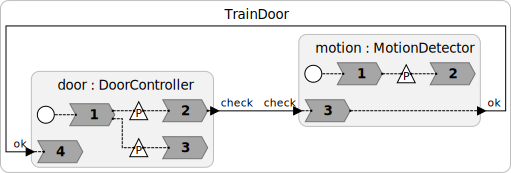

# Train Door
This demo gives a simple interactive program that shows how to use the threading library in Python to handle blocking functions. For an alternative mechanism using enclaves, see [ReflexGameEnclaves.lf](../reflex-game/README.md).

## Installation

Required packages:

```
pip3 install threading
```

## Programs

<table>
<tr>
<td> 
<td> <a href="TrainDoor.lf">TrainDoor.lf</a>: Interactive program using the threading library to get user inputs. This models a simple train door controller.</td>
</tr>
</table>
