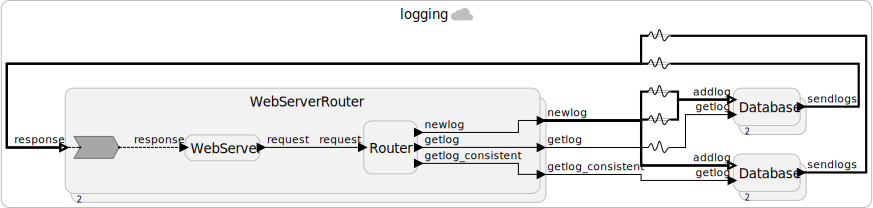

# Web Server

This example shows how to create an HTTP web server backend in Lingua Franca python target.

## Application

In this example, we will build a distributed logging service with two replicated databases, each database with an HTTP web server that handles add log and get log requests from frontend. The HTTP web server backend is `Logging.lf`, and the frontend is `logging.html`. Valid requests are of the following three kinds:

- Add log: adds a log to the distributed database. The add log request is broadcast to all database replicas.
- Get log: get all historical logs from a single database. This returns without waiting for consistency, so the logs could be out of order and inconsistent with each other.
- Get log consistent: get consistent historical logs from a single database. This request will respond more slowly but with consistency, meaning requests to different replicas will return identical logs if the requests have the same timestamp.

## HTTP Server

Building an HTTP server in the Lingua Franca Python target is a nontrivial task for several reasons:

- The HTTP server in Python involves blocking operations that prevent a reaction from finishing.
- Typical Python web frameworks use a decorator style and require you to return the response in the handler function, but to utilize the full potential of Lingua Franca, we often need to implement logic in different reactions.

To tackle these issues, we can:

- Start the HTTP server in a separate thread, so it doesn't block the execution of reactions. Handlers act as external triggers to the Lingua Franca program.
- The `WebServer` reactor has a state variable `events` that is a dictionary of `event_id`->[asyncio event](https://docs.python.org/3/library/asyncio.html)
- The handler will add an event to the state `events` when a request comes in, trigger an action in Lingua Franca, and complete the request when the event is unblocked.

## Minimal +1 Example

First, let's build a minimal web server that adds one to the number in the request. The backend is in `Minimal.lf`, and frontend is `minimal.html`.

The handler is as follows:

```python
@self.app.post("/addone")
async def addone(request: Request):
    event = asyncio.Event()
    request_id = str(uuid.uuid4())
    self.events[request_id] = event
    num = int((await request.json())["data"])
    addone_action.schedule(0, [request_id, num])
    await event.wait()
    num = self.events[request_id]
    del self.events[request_id]
    return {"status": "success", "num": num}
```

`self` here refers to the `WebServer` reactor in which the handler is defined. The `self.app` is an instance of `FastAPI` application instance, defined as a state of the `WebServer` reactor. Import statements are in the `preamble` and not shown here for simplicity. This handler function will be triggered to generate a response to an HTTP `POST` request at the `/addone` path.

And the reaction to the action is

```python
reaction(addone_action){=
    request_id, num = addone_action.value
    event = self.events[request_id]
    self.events[request_id] = num + 1
    event.set()
=}
```

When a request is processed by a handler, a response is generated in the following steps:

1. Create a python async io event and add it to `self.events`.
2. Trigger a physical action in Lingua Franca to process the request.
3. Block the handler until the event is unblocked by another reaction.
4. When the action has been processed, another reaction unblocks the asyncio event.
5. The handler can now continue to execute and respond to the web request.

## Minimal +1 Example with WebServer Library

We can also build the +1 example with the prebuilt `WebServer` library at `../lib/WebServer.lf` that modularizes the web server. You only have to implement the following code to accomplish the same functionality, as demonstrated in `MinimalWithLib.lf`:

```python
target Python {
  coordination: decentralized
}

import WebServer from "../lib/WebServer.lf"

reactor Handler {
  input request
  output response

  reaction(request) -> response {=
    request_id, req_data = request.value
    num = int(req_data["data"])
    num += 1
    resp = {"status": "success", "num": num}
    response.set([request_id, resp])
  =}
}

main reactor {
  server = new WebServer(path="/addone")
  handler = new Handler()
  server.request -> handler.request
  handler.response ~> server.response
}

```

Note that the `request_id` has to be sent to and from the `Handler` reactor so that the `WebServer` knows which request to respond to. Also, notice that the response is connected with a physical connection `~>`, this is because these connections carry no timing semantics -- they simply carry the data to be sent back to the frontend as a response and need to be executed as soon as possible. This also prevents an STP violation from being triggered.

## Distributed Logging



To implement our distributed logging application, we need to respond to three distinct operations, but the reusable `WebServer` reactor has only one API path. We can solve this by introducing a new `Router` reactor and [composing reactors](https://www.lf-lang.org/docs/writing-reactors/composing-reactors), as shown in the diagram above. Each HTTP request body now carries an additional `operation` field that allows the router to route the request to different reactions through connections.

Now we can implement a distributed logging system by instantiating several `WebServer` reactors on different network ports and adding two `Database` reactors for each `WebServer`.

* One `Database` reactor has an STA offset of 0 and is connected by physical connections. This will prioritize availability, generating a quick response that is not (necessarily) consistent.
* Another `Database` reactor has an STA offset of 3s (this can be changed) and is connected by logical connections. This will guarantee that the logs in this `Database` reactor will be consistent as long as out-of-order messages arrive within 3s.

Note that this is implemented with banks and multiports. When sending logs, we want the `WebServer` to send logs to all `Database` reactors, so the `newlog` connection is implemented with broadcasts; but when getting logs, we want to know the log state of the single corresponding `Database` reactor, hence there is no broadcast here. In the last line, `db.sendlogs, dbc.sendlogs ~> interleaved(server.response)` uses interleaved connections because each `WebServer` corresponds to two `Database`, one consistent and one not, and we need to avoid having a `WebServer` connecting to two inconsistent databases and another connecting to two consistent databases.
