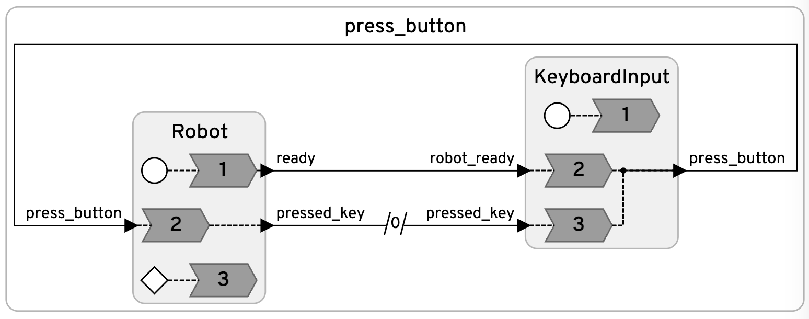

# WidowX Button Pressing

An interactive Lingua Franca application that drives a [Trossen WidowX AI](https://www.trossenrobotics.com/widowx-ai) robotic arm to press keys on a numpad. The user types a key name, and the arm moves to a calibrated hover position above the key, presses it, and returns — then prompts for the next key.



- [PressButton.lf](PressButton.lf) — main program. The `KeyboardInput` reactor prompts for a key after the robot signals ready, validates it, and sends it to the robot. The next prompt only appears after the previous press completes.
- [Robot.lf](Robot.lf) — the `Robot` reactor. Connects to the arm via the `trossen_arm` driver, homes it on startup, executes the hover → press → hover sequence for each key, and returns home on shutdown.
- [positions.json](positions.json) — calibrated hover/press joint positions for each key.
- [scene_numpad.xml](scene_numpad.xml) — MuJoCo scene (arm + numpad) matching `positions.json`, for running in simulation.

## Setup

Install the [Lingua Franca compiler](https://www.lf-lang.org/docs/installation) (`lfc`) and the arm driver plus simulator:

```bash
pip install trossen_arm_sim
```

[trossen_arm_sim](https://github.com/depetrol/trossen_arm_sim) speaks the same wire protocol as the real arm controller, so the unmodified `trossen_arm` driver connects to it as if it were hardware, with the arm running in MuJoCo. It installs the `trossen_arm` driver as a dependency.

## Run

From `examples/Python`, start the simulator in one terminal:

```bash
trossen-arm-sim src/widowx/scene_numpad.xml
```

To see the arm in the MuJoCo viewer, add `--viewer` (on macOS the viewer must run under `mjpython`, which is installed with `mujoco`):

```bash
mjpython -m trossen_arm_sim src/widowx/scene_numpad.xml --viewer   # macOS
python -m trossen_arm_sim src/widowx/scene_numpad.xml --viewer    # Linux
```

Compile and run the application in another:

```bash
lfc src/widowx/PressButton.lf
bin/PressButton
```

Enter a key name (e.g. `5`, `enter`, `backspace`) to press it, or `q` to quit and return the arm home.

## Using a real arm

Set the `ROBOT_HOST` environment variable to the controller's IP (or change the `host` parameter of `Robot` in the main reactor, which defaults to the simulator at `127.0.0.1`):

```bash
ROBOT_HOST=192.168.1.2 bin/PressButton
```

Positions in `positions.json` are specific to the arm and numpad placement; record your own with a calibration script before using real hardware.
