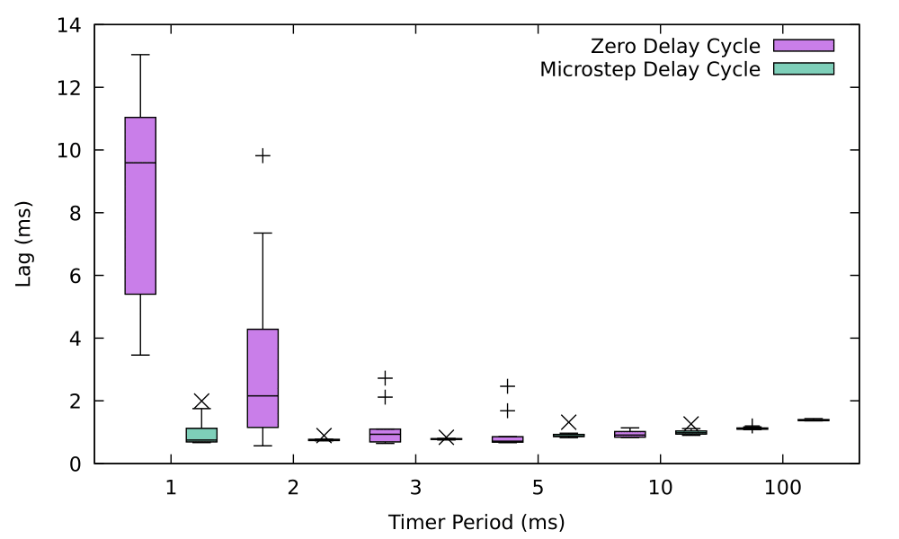
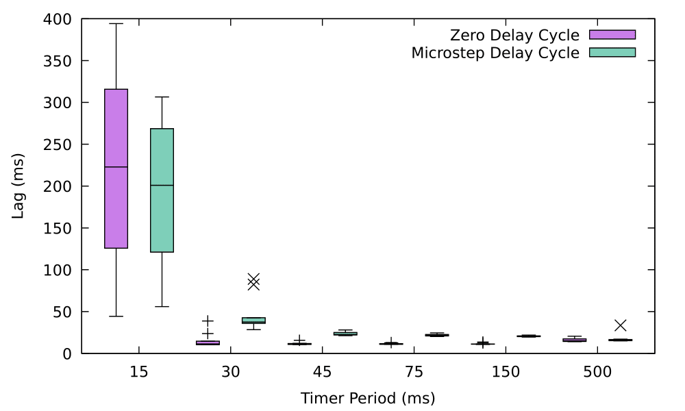
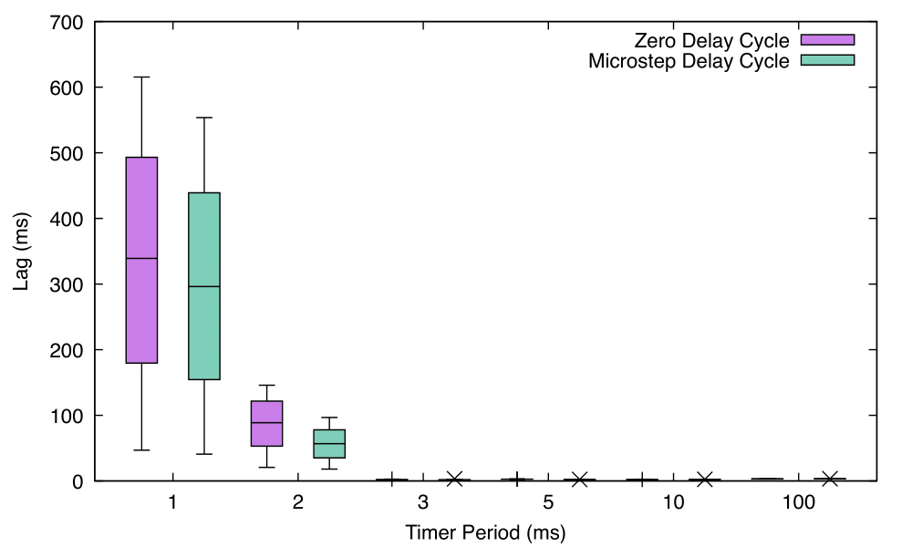
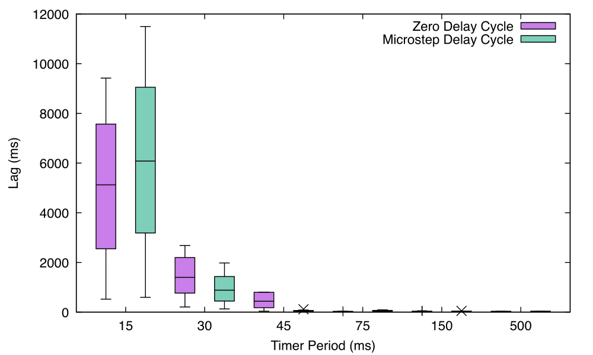
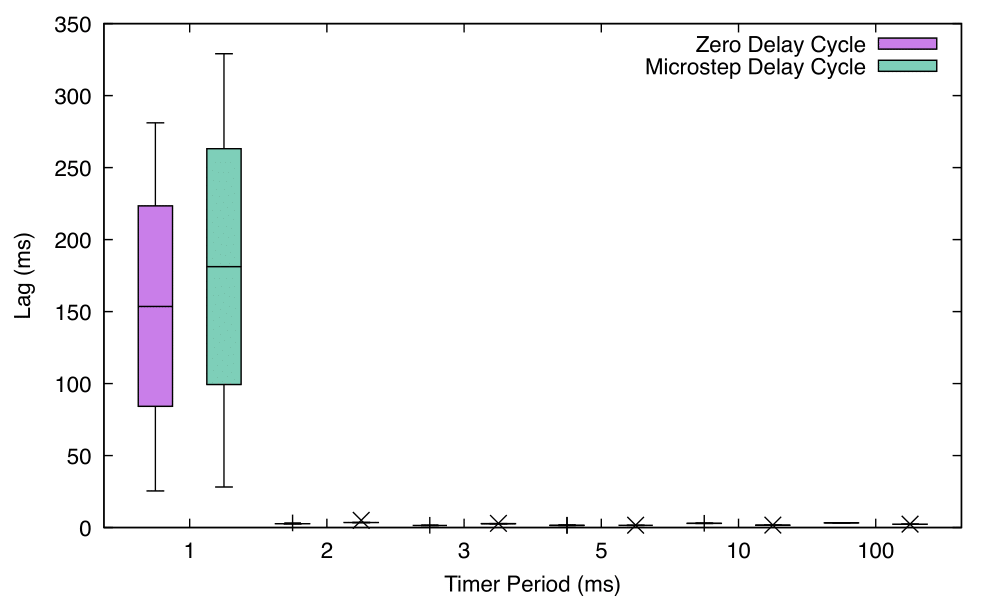
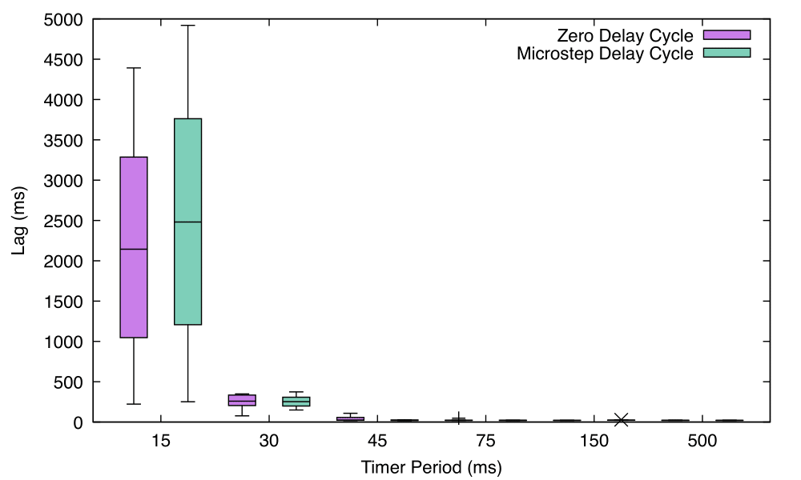

# Experiment Results
## ZeroDelayCycle.lf & MicrostepDelayCycle.lf
### Under LAN setup

| ZeroDelayCycle.lf | | | | | | | MicrostepDelayCycle.lf | | | | | | |
|------------|------|------|------|------|-----|---------|-------------|------|------|------|------|-------|---------|
| Timer ticks | 1 ms | 2 ms | 3 ms | 5 ms | 10 ms | 100 ms | Timer ticks | 1 ms | 2 ms | 3 ms | 5 ms | 10 ms | 100 ms |
| 1-50 | 9.55 | 2.42 | 0.92 | 2.46 | 1.14 | 1.20 | 1-50 | 1.12 | 0.77 | 0.84 | 0.97 | 1.26 | 1.43 |
| 51-100 | 11.25 | 1.89 | 2.72 | 0.86 | 1.02 | 1.17 | 51-100 | 0.68 | 0.73 | 0.80 | 0.93 | 1.12 | 1.42 |
| 101-150 | 9.63 | 0.88 | 2.12 | 0.74 | 0.90 | 1.13 | 101-150 | 1.99 | 0.76 | 0.75 | 0.90 | 1.01 | 1.38 |
| 151-200 | 10.30 | 1.85 | 0.81 | 0.71 | 1.06 | 1.09 | 151-200 | 0.89 | 0.76 | 0.76 | 1.32 | 1.04 | 1.37 |
| 201-250 | 13.04 | 0.57 | 0.69 | 0.68 | 0.87 | 1.13 | 201-250 | 0.70 | 0.73 | 0.77 | 0.88 | 0.98 | 1.37 |
| 251-300 | 11.04 | 1.15 | 0.66 | 0.72 | 1.01 | 1.08 | 251-300 | 0.69 | 0.74 | 0.79 | 0.87 | 0.94 | 1.36 |
| 301-350 | 6.81 | 9.82 | 0.64 | 1.69 | 0.91 | 1.09 | 301-350 | 0.72 | 0.78 | 0.78 | 0.86 | 0.98 | 1.37 |
| 351-400 | 5.40 | 7.35 | 0.94 | 0.69 | 0.84 | 1.13 | 351-400 | 0.67 | 0.89 | 0.78 | 0.87 | 0.92 | 1.36 |
| 401-450 | 4.45 | 3.29 | 1.10 | 0.67 | 0.83 | 1.11 | 401-450 | 0.78 | 0.72 | 0.78 | 0.82 | 0.90 | 1.39 |
| 451-500 | 3.46 | 4.28 | 0.96 | 0.67 | 0.84 | 1.12 | 451-500 | 1.75 | 0.73 | 0.79 | 0.84 | 0.94 | 1.40 |

### Under WiFi setup

| ZeroDelayCycle.lf | | | | | | | MicrostepDelayCycle.lf | | | | | | |
|------------|------|------|------|------|-----|---------|-------------|------|------|------|------|-------|---------|
| Timer ticks | 1 ms | 2 ms | 3 ms | 5 ms | 10 ms | 100 ms | Timer ticks | 1 ms | 2 ms | 3 ms | 5 ms | 10 ms | 100 ms |
| 1-50 | 44.4 | 10.5 | 11.0 | 11.2 | 11.1 | 15.0 | 1-50 | 56.0 | 37.3 | 22.1 | 24.5 | 20.9 | 17.0 |
| 51-100 | 90.1 | 23.8 | 10.7 | 11.1 | 10.8 | 14.4 | 51-100 | 88.0 | 37.0 | 21.3 | 22.6 | 19.6 | 33.6 |
| 101-150 | 125.8 | 38.8 | 10.8 | 11.7 | 12.4 | 14.1 | 101-150 | 121.1 | 42.7 | 28.1 | 20.9 | 20.7 | 15.7 |
| 151-200 | 165.6 | 14.6 | 10.8 | 12.9 | 13.6 | 14.2 | 151-200 | 155.3 | 36.0 | 26.3 | 21.9 | 21.9 | 15.1 |
| 201-250 | 203.4 | 10.4 | 12.1 | 10.9 | 11.3 | 14.3 | 201-250 | 186.5 | 37.7 | 25.0 | 21.3 | 21.6 | 16.1 |
| 251-300 | 242.4 | 11.1 | 15.7 | 10.9 | 11.1 | 20.6 | 251-300 | 215.4 | 31.3 | 24.2 | 21.7 | 20.1 | 15.2 |
| 301-350 | 277.3 | 11.8 | 11.8 | 10.9 | 11.0 | 19.6 | 301-350 | 242.7 | 28.4 | 22.1 | 21.7 | 20.2 | 16.6 |
| 351-400 | 315.8 | 10.5 | 10.7 | 10.9 | 11.1 | 17.4 | 351-400 | 268.6 | 41.6 | 22.4 | 24.2 | 20.8 | 15.3 |
| 401-450 | 355.9 | 10.5 | 10.8 | 11.1 | 10.8 | 15.2 | 401-450 | 285.2 | 89.0 | 22.9 | 20.2 | 21.0 | 15.8 |
| 451-500 | 394.2 | 12.3 | 10.9 | 12.6 | 11.1 | 15.4 | 451-500 | 306.5 | 82.3 | 21.8 | 20.2 | 20.4 | 15.0 |

## Feedback.lf & FeedbackMicrostep.lf
### Under LAN setup
#### Reactor Conroller

| Feedback.lf | | | | | | | FeedbackMicrostep.lf | | | | | | |
|------------|------|------|------|------|-----|---------|-------------|------|------|------|------|-------|---------|
| 1-50 | 46.86 | 20.70 | 2.74 | 2.87 | 2.23 | 3.14 | 1-50 | 40.87 | 18.12 | 3.24 | 2.30 | 2.45 | 3.42 |
| 51-100 | 114.86 | 38.31 | 1.88 | 2.73 | 2.14 | 3.05 | 51-100 | 99.36 | 27.41 | 2.08 | 2.17 | 2.31 | 3.35 |
| 101-150 | 179.62 | 52.98 | 1.83 | 2.69 | 2.13 | 3.08 | 101-150 | 154.36 | 35.11 | 2.06 | 2.18 | 2.34 | 3.35 |
| 151-200 | 244.12 | 67.72 | 2.02 | 2.69 | 2.12 | 3.06 | 151-200 | 210.34 | 43.65 | 2.07 | 2.17 | 2.30 | 3.35 |
| 201-250 | 307.94 | 82.03 | 2.00 | 2.67 | 2.11 | 3.08 | 201-250 | 266.95 | 52.71 | 2.13 | 2.18 | 2.28 | 3.32 |
| 251-300 | 370.14 | 95.41 | 2.00 | 2.68 | 2.12 | 3.10 | 251-300 | 325.36 | 60.87 | 2.04 | 2.18 | 2.33 | 3.32 |
| 301-350 | 432.36 | 108.93 | 1.97 | 2.67 | 2.11 | 3.14 | 301-350 | 382.93 | 68.92 | 2.05 | 2.19 | 2.27 | 3.30 |
| 351-400 | 493.12 | 121.61 | 1.88 | 2.69 | 2.10 | 3.11 | 351-400 | 439.05 | 77.89 | 2.06 | 2.15 | 2.21 | 3.31 |
| 401-450 | 553.72 | 134.29 | 1.88 | 2.68 | 2.11 | 3.13 | 401-450 | 496.40 | 87.10 | 2.10 | 2.16 | 2.25 | 3.31 |
| 451-500 | 615.41 | 145.88 | 1.88 | 2.69 | 2.08 | 3.14 | 451-500 | 553.56 | 96.73 | 2.10 | 2.15 | 2.27 | 3.31 |

#### Reactor PhysicalPlant

| Feedback.lf | | | | | | | FeedbackMicrostep.lf | | | | | | |
|------------|------|------|------|------|-----|---------|-------------|------|------|------|------|-------|---------|
| Timer ticks | 1 ms | 2 ms | 3 ms | 5 ms | 10 ms | 100 ms | Timer ticks | 1 ms | 2 ms | 3 ms | 5 ms | 10 ms | 100 ms |
| 1-50 | 47.52 | 21.01 | 3.46 | 3.30 | 2.64 | 3.71 | 1-50 | 39.50 | 16.74 | 1.79 | 0.87 | 0.96 | 1.74 |
| 51-100 | 115.47 | 38.56 | 2.59 | 3.12 | 2.52 | 3.64 | 51-100 | 98.03 | 26.11 | 0.73 | 0.76 | 0.88 | 1.69 |
| 101-150 | 180.22 | 53.23 | 2.53 | 3.08 | 2.50 | 3.67 | 101-150 | 153.02 | 33.77 | 0.72 | 0.77 | 0.90 | 1.70 |
| 151-200 | 244.73 | 67.98 | 2.72 | 3.09 | 2.49 | 3.64 | 151-200 | 208.99 | 42.29 | 0.72 | 0.78 | 0.87 | 1.71 |
| 201-250 | 308.53 | 82.28 | 2.69 | 3.06 | 2.47 | 3.65 | 201-250 | 265.62 | 51.36 | 0.74 | 0.79 | 0.87 | 1.71 |
| 251-300 | 370.73 | 95.65 | 2.69 | 3.07 | 2.49 | 3.69 | 251-300 | 324.01 | 59.54 | 0.69 | 0.77 | 0.88 | 1.72 |
| 301-350 | 432.95 | 109.18 | 2.67 | 3.07 | 2.47 | 3.73 | 301-350 | 381.60 | 67.59 | 0.69 | 0.78 | 0.87 | 1.69 |
| 351-400 | 493.71 | 121.86 | 2.59 | 3.08 | 2.47 | 3.69 | 351-400 | 437.73 | 76.54 | 0.70 | 0.74 | 0.84 | 1.71 |
| 401-450 | 554.32 | 134.54 | 2.58 | 3.07 | 2.48 | 3.73 | 401-450 | 495.08 | 85.76 | 0.71 | 0.75 | 0.84 | 1.70 |
| 451-500 | 616.02 | 146.14 | 2.57 | 3.09 | 2.44 | 3.72 | 451-500 | 552.23 | 95.39 | 0.75 | 0.75 | 0.84 | 1.68 |

### Under WiFi setup
#### Reactor Conroller

| Feedback.lf | | | | | | | FeedbackMicrostep.lf | | | | | | |
|------------|------|------|------|------|-----|---------|-------------|------|------|------|------|-------|---------|
| Timer ticks | 1 ms | 2 ms | 3 ms | 5 ms | 10 ms | 100 ms | Timer ticks | 1 ms | 2 ms | 3 ms | 5 ms | 10 ms | 100 ms |
| 1-50 | 523.21 | 208.40 | 38.91 | 24.32 | 33.58 | 27.85 | 1-50 | 596.25 | 128.94 | 33.60 | 35.34 | 34.67 | 33.78 |
| 51-100 | 1520.73 | 501.41 | 115.88 | 24.80 | 32.29 | 29.06 | 51-100 | 1907.02 | 313.52 | 30.73 | 29.87 | 36.51 | 34.79 |
| 101-150 | 2549.56 | 765.60 | 179.39 | 27.85 | 32.10 | 30.22 | 101-150 | 3186.75 | 446.62 | 63.67 | 36.10 | 35.16 | 34.15 |
| 151-200 | 3611.89 | 1062.43 | 219.71 | 31.74 | 34.04 | 31.04 | 151-200 | 4410.51 | 574.06 | 86.82 | 41.56 | 31.50 | 34.40 |
| 201-250 | 4609.88 | 1305.28 | 384.22 | 27.87 | 36.22 | 32.96 | 201-250 | 5490.57 | 760.13 | 59.33 | 68.84 | 31.66 | 31.52 |
| 251-300 | 5633.37 | 1496.24 | 493.47 | 26.99 | 30.94 | 27.07 | 251-300 | 6666.64 | 1005.65 | 55.78 | 41.45 | 38.85 | 33.78 |
| 301-350 | 6591.64 | 1894.94 | 598.07 | 28.40 | 28.54 | 27.92 | 301-350 | 7843.55 | 1196.60 | 32.95 | 85.33 | 37.44 | 31.45 |
| 351-400 | 7568.12 | 2196.57 | 805.44 | 27.63 | 32.52 | 28.42 | 351-400 | 9051.57 | 1431.76 | 116.86 | 91.83 | 33.17 | 33.20 |
| 401-450 | 8533.97 | 2456.20 | 802.08 | 25.71 | 51.64 | 27.94 | 401-450 | 10304.85 | 1669.02 | 63.16 | 53.28 | 50.25 | 34.25 |
| 451-500 | 9419.03 | 2681.64 | 799.82 | 27.73 | 47.14 | 30.95 | 451-500 | 11494.72 | 1978.27 | 31.50 | 63.44 | 38.34 | 33.09 |

#### Reactor PhysicalPlant

| Feedback.lf | | | | | | | FeedbackMicrostep.lf | | | | | | |
|------------|------|------|------|------|-----|---------|-------------|------|------|------|------|-------|---------|
| Timer ticks | 1 ms | 2 ms | 3 ms | 5 ms | 10 ms | 100 ms | Timer ticks | 1 ms | 2 ms | 3 ms | 5 ms | 10 ms | 100 ms |
| 1-50 | 527.16 | 212.66 | 43.00 | 27.99 | 38.64 | 31.96 | 1-50 | 578.40 | 113.54 | 18.32 | 19.41 | 18.35 | 17.63 |
| 51-100 | 1524.46 | 505.29 | 120.37 | 28.57 | 37.76 | 33.42 | 51-100 | 1888.94 | 297.88 | 15.70 | 14.23 | 20.01 | 17.03 |
| 101-150 | 2553.46 | 769.71 | 183.47 | 31.63 | 36.39 | 34.38 | 101-150 | 3168.27 | 431.70 | 48.39 | 19.64 | 18.49 | 17.90 |
| 151-200 | 3615.86 | 1066.48 | 223.95 | 36.07 | 38.91 | 35.86 | 151-200 | 4393.55 | 557.94 | 71.68 | 25.22 | 16.17 | 17.62 |
| 201-250 | 4614.26 | 1309.30 | 388.12 | 31.79 | 40.76 | 37.65 | 201-250 | 5473.04 | 744.07 | 44.09 | 51.85 | 16.02 | 15.83 |
| 251-300 | 5637.30 | 1500.07 | 497.71 | 31.12 | 35.55 | 31.35 | 251-300 | 6648.75 | 989.86 | 39.84 | 24.90 | 20.79 | 16.88 |
| 301-350 | 6595.64 | 1899.46 | 602.44 | 32.33 | 33.05 | 31.87 | 301-350 | 7826.14 | 1181.09 | 17.73 | 66.95 | 19.05 | 15.93 |
| 351-400 | 7572.55 | 2200.32 | 809.10 | 31.38 | 36.86 | 32.49 | 351-400 | 9032.46 | 1416.45 | 99.17 | 73.90 | 16.63 | 16.52 |
| 401-450 | 8537.52 | 2460.18 | 805.74 | 29.51 | 57.03 | 31.95 | 401-450 | 10286.95 | 1653.00 | 47.97 | 37.32 | 31.88 | 17.59 |
| 451-500 | 9422.38 | 2685.43 | 803.47 | 32.03 | 51.61 | 35.69 | 451-500 | 11476.84 | 1962.40 | 16.86 | 46.18 | 20.39 | 16.68 |

## Consistency.lf & ConsistencyMicrostep.lf
### Under LAN setup

| Consistency.lf | | | | | | | ConsistencyMicrostep.lf | | | | | | |
|------------|------|------|------|------|-----|---------|-------------|------|------|------|------|-------|---------|
| 1-50 | 25.45 | 3.19 | 1.58 | 1.59 | 2.98 | 3.29 | 1-50 | 28.15 | 5.03 | 2.90 | 1.63 | 1.71 | 2.37 |
| 51-100 | 56.58 | 2.65 | 1.44 | 1.49 | 2.92 | 3.26 | 51-100 | 65.82 | 3.48 | 2.70 | 1.53 | 1.62 | 2.31 |
| 101-150 | 84.17 | 2.65 | 1.43 | 1.48 | 2.91 | 3.26 | 101-150 | 99.33 | 3.49 | 2.71 | 1.53 | 1.64 | 2.33 |
| 151-200 | 111.96 | 2.65 | 1.44 | 1.50 | 2.91 | 3.27 | 151-200 | 132.44 | 3.49 | 2.70 | 1.52 | 1.62 | 2.29 |
| 201-250 | 139.65 | 2.66 | 1.44 | 1.51 | 2.91 | 3.26 | 201-250 | 164.86 | 3.48 | 2.70 | 1.52 | 1.63 | 2.29 |
| 251-300 | 167.43 | 2.66 | 1.44 | 1.50 | 2.91 | 3.27 | 251-300 | 197.54 | 3.48 | 2.71 | 1.52 | 1.63 | 2.29 |
| 301-350 | 195.18 | 2.66 | 1.43 | 1.50 | 2.91 | 3.27 | 301-350 | 230.19 | 3.48 | 2.71 | 1.53 | 1.60 | 2.30 |
| 351-400 | 223.41 | 2.65 | 1.43 | 1.51 | 2.91 | 3.28 | 351-400 | 263.12 | 3.49 | 2.70 | 1.53 | 1.59 | 2.30 |
| 401-450 | 252.83 | 2.66 | 1.44 | 1.52 | 2.91 | 3.27 | 401-450 | 296.13 | 3.49 | 2.71 | 1.52 | 1.59 | 2.30 |
| 451-500 | 281.08 | 2.66 | 1.43 | 1.50 | 2.90 | 3.26 | 451-500 | 329.08 | 3.48 | 2.71 | 1.52 | 1.59 | 2.28 |

### Under WiFi setup

| Consistency.lf | | | | | | | ConsistencyMicrostep.lf | | | | | | |
|------------|------|------|------|------|-----|---------|-------------|------|------|------|------|-------|---------|
| 1-50 | 222.53 | 76.72 | 17.42 | 20.00 | 20.69 | 21.72 | 1-50 | 251.38 | 149.39 | 19.36 | 19.06 | 24.74 | 21.98 |
| 51-100 | 643.15 | 148.42 | 22.63 | 20.55 | 19.98 | 20.55 | 51-100 | 714.00 | 198.56 | 17.27 | 19.36 | 28.37 | 21.02 |
| 101-150 | 1046.61 | 204.69 | 19.48 | 20.64 | 20.06 | 22.82 | 101-150 | 1207.10 | 211.20 | 20.06 | 21.79 | 23.26 | 20.42 |
| 151-200 | 1512.75 | 238.76 | 22.24 | 20.38 | 20.83 | 21.65 | 151-200 | 1713.32 | 253.03 | 21.39 | 22.97 | 22.12 | 20.69 |
| 201-250 | 1926.49 | 262.23 | 24.46 | 23.35 | 20.31 | 21.22 | 201-250 | 2226.49 | 307.58 | 20.72 | 18.91 | 21.66 | 19.73 |
| 251-300 | 2361.49 | 256.17 | 22.56 | 20.50 | 21.34 | 19.93 | 251-300 | 2734.57 | 374.20 | 19.30 | 18.19 | 22.45 | 19.49 |
| 301-350 | 2791.15 | 305.43 | 34.52 | 21.36 | 20.41 | 21.04 | 301-350 | 3234.62 | 347.59 | 27.26 | 21.41 | 22.15 | 20.97 |
| 351-400 | 3286.46 | 334.25 | 57.42 | 20.35 | 19.67 | 19.98 | 351-400 | 3761.64 | 295.61 | 25.09 | 22.05 | 22.15 | 19.69 |
| 401-450 | 3847.32 | 349.14 | 108.66 | 22.12 | 20.69 | 20.05 | 401-450 | 4352.15 | 252.32 | 25.53 | 20.51 | 21.70 | 20.33 |
| 451-500 | 4391.91 | 349.15 | 96.80 | 48.09 | 21.08 | 21.46 | 451-500 | 4919.65 | 191.63 | 27.32 | 23.00 | 24.14 | 22.09 |